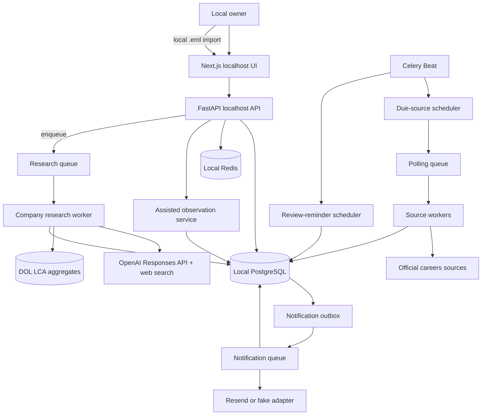

# JobScout AI — Local-First V1 System Design and Implementation Specification

**Status:** Milestones 1–6 implemented; Milestone 7 not started  
**Audience:** AI coding agents and human contributors  
**Product stage:** Single-user, local-first V1  
**Last updated:** 2026-08-30  

---

## 0. Coding-agent directive

Read this document completely before editing the repository.

Build JobScout AI in the milestone order in Section 22. Complete and verify one milestone before beginning the next. Do not replace fixed technology choices, expand V1 scope, or silently weaken acceptance criteria. If an external credential is unavailable, implement the documented adapter with a deterministic fake and report the blocked live verification.

If you are working in an existing checkout, read Section 0.1 first: Milestones 1–6 are already built,
and passages describing unbuilt behavior carry a **[NOT IMPLEMENTED]** marker. Where this document and
the code disagree, the code and Alembic migrations win — fix the document in the same change.

The goal is a working vertical slice, not disconnected scaffolding.

### 0.1 Implementation status (as built)

This section records what the repository actually contains today. Sections that describe unbuilt
behavior are marked **[NOT IMPLEMENTED]** at the point of the claim. Treat those as the specification
to build, not as a description of existing code.

| Milestone | Status |
|---|---|
| 1 — Local foundation | Implemented |
| 2 — Catalog, DOL import, manual addition | Implemented |
| 3 — AI industry discovery | Implemented |
| 4 — Monitoring and lifecycle | Implemented |
| 5 — Alerts and notifications | Implemented |
| 6 — Source recovery and alternate observations | Implemented |
| 7 — Hardening and showcase | **Not started.** No metrics, ops page, load test, or eval scorers |

Careers-page resolution (Section 13.7) and the shared `job-links-v2` extraction rules (Section 13.3)
were added after Milestone 6 as a correctness fix to Milestones 3 and 4: discovery previously accepted
any cited same-domain URL as a careers page without opening it, and the generic adapter then read that
page's navigation as jobs. Migration `b8c9d0e1f2a3` deletes the `generic_html` sources produced under
the old rules.

Known gaps inside otherwise-complete milestones:

- Typed manual job entry and mailbox/IMAP ingestion are intentionally not part of the implemented
  assisted workflow. V1 accepts an owner-uploaded local `.eml` file only.
- Prompt text lives inline in `app/ai/client.py`. The unused prompt files that previously sat under
  `app/ai/prompts/` have been deleted (Section 10.2).
- No OpenTelemetry or Prometheus metrics exist. API mutation routes do not consume a client
  `Idempotency-Key`; Resend delivery does use a provider idempotency key derived from the durable
  outbox row and request fingerprint.

---

## 1. Product vision

JobScout AI is a private company-discovery and job-monitoring system for one international student.

It does two things:

1. **Company discovery:** The user enters an industry such as `gaming companies`. JobScout researches and ranks up to 20 relevant US employers, locates their official careers pages, and presents sourced evidence about historical H-1B activity and internships.
2. **Job observation:** The user saves recommended companies or manually adds companies. JobScout
   automatically monitors documented providers and permitted public sources, accepts an
   owner-uploaded employer-alert email, or schedules a local review reminder when automation is
   unavailable.
   Complete automatic sources detect the full job lifecycle; incomplete sources never infer closure.

All companies, preferences, jobs, research results, and alerts belong to this installation. Other users use the project by running their own independent installation.

### 1.1 Product statement

> JobScout AI helps international students discover employers in a chosen industry, understand historical sponsorship signals, monitor official career sources, and receive timely alerts when relevant jobs appear.

### 1.2 Primary user

One student seeking US internships and early-career software, AI, or data roles. V1 has no accounts, teams, or shared database.

### 1.3 V1 success condition

The local owner can:

1. Start the full application with documented local commands.
2. Configure one local profile and job-alert preferences.
3. Search for an industry and receive a cited list of up to 20 real US employers.
4. See each employer's official careers URL, monitoring support, historical H-1B/LCA evidence, and internship evidence.
5. Reopen searches from the current machine-local day's **Daily history** and save companies that
   were missed the first time.
6. Save selected companies, save all monitorable results, reversibly hide unwanted results, or manually add a company.
7. See currently open jobs from supported saved companies.
8. Repair a blocked or broken careers source by replacing it with a verified direct provider URL.
9. For unsupported sources, schedule a machine-local review reminder or directly import a local
   `.eml` employer alert for a saved company.
10. Keep the laptop awake and receive one deduplicated email and in-app alert when a later
    observation discovers matching jobs.
11. Inspect why a company or job was included, how complete its source is, and where each material
    fact came from.

### 1.4 Local operation semantics

- Services bind to localhost by default.
- PostgreSQL stores durable local state.
- Redis and Celery run local background work.
- Monitoring works while the laptop is awake, online, and the services are running.
- After sleep or downtime, due sources are polled when services resume.
- JobScout cannot recover a posting that appeared and disappeared entirely while it was offline.
- Docker restart policies and idempotent tasks provide recovery after process restarts.
- The browser displays timestamps in the operating system's local time. There is no JobScout
  timezone preference.
- Calendar-day behavior uses the browser's exact local-midnight boundaries. Durable timestamps,
  source schedules, leases, retries, and rolling cache expiry remain UTC instants or elapsed
  durations.
- Recurring source polling is server-side and continues when the JobScout browser tab is closed, as
  long as the local services remain running.

### 1.5 V1 scale target

Design and load-test one installation for:

- 500 saved companies
- 1,000 unique careers sources
- 100,000 stored jobs
- 25,000 job events per year
- 2,000 notification deliveries per month

These are engineering targets, not expected personal usage.

---

## 2. Product semantics and honesty requirements

### 2.1 “Top 20”

`Top 20` means the highest-ranked evaluation subset found during a bounded research run. It is not
an exhaustive census or a display cap: when a run persists additional verified candidates, the
result page renders those candidates too.

The UI must state:

> Ranked recommendations based on available public evidence. Results are not exhaustive, and sponsorship history does not guarantee sponsorship for a specific role.

### 2.2 Sponsorship evidence

V1 uses recent US Department of Labor H-1B Labor Condition Application disclosure data as historical evidence.

Allowed wording:

- `127 certified H-1B LCAs found across FY2023–FY2025`
- `Strong historical H-1B filing evidence`
- `No matching records found in the loaded dataset`

Forbidden wording:

- `This company will sponsor you`
- `Guaranteed sponsorship`
- `H-1B approvals` when the underlying data is LCA disclosure data

### 2.3 Monitoring support

Saving and monitoring are separate states:

```text
PENDING_RESOLUTION
SUPPORTED
DEGRADED
UNSUPPORTED
PAUSED
ASSISTED
RETIRED
```

An unsupported company may be saved, but the UI must never imply it is being monitored.

Every careers source also exposes one observation mode and one lifecycle capability:

| Mode | Allowed input | Scheduling |
|---|---|---|
| `automatic` | A documented ATS API, an explicitly publisher-provided feed, or the permitted conservative HTML adapter | JobScout schedules fetches |
| `assisted` | An owner-uploaded `.eml` file | Only an explicit owner action creates an observation |
| `reminder_only` | A careers page that JobScout cannot or may not fetch reliably | JobScout schedules a local reminder, never a page fetch |

| Capability | Meaning |
|---|---|
| `full_lifecycle` | A successful complete observation may add/update jobs and contribute to the two-observation closure rule |
| `add_update_only` | An observation may add/update/reopen jobs but absence is never evidence of closure |
| `none` | No job observation occurs; only owner review state and reminders are recorded |

Mode and capability are separate. A permitted generic HTML source is `automatic` but
`add_update_only`; it must not be presented as equivalent to a documented complete provider. An
assisted observation is always `add_update_only`, even when the uploaded alert appears to list every
job. Only a provider contract or publisher documentation can justify `full_lifecycle`.

### 2.4 First synchronization

When a company is first saved:

- current jobs are imported and displayed;
- they become the saved-company alert baseline;
- they do not produce “new job” email alerts by default;
- jobs first observed during later automatic or owner-triggered assisted observations may alert.

The owner can explicitly enable `Notify me about currently open jobs`.

---

## 3. V1 scope

### 3.1 Included

- Single local owner profile and preferences
- Natural-language industry search
- AI-assisted company research with web search
- Structured, cited company recommendations
- Local research-result caching
- Machine-local Daily history for persisted industry searches
- Company identity and legal-entity alias resolution
- Import and aggregation of official DOL LCA disclosure files
- Evidence-aware historical sponsorship status
- Official careers-page resolution
- Greenhouse, Lever, Ashby, and SmartRecruiters monitoring adapters
- Conservative generic HTML-link adapter for server-rendered public career pages
- Source-repair preview and confirmed replacement workflow
- Owner-triggered local `.eml` job-alert imports
- Machine-local reminders for unsupported sources
- Manual company addition
- Save selected, save all, hide, remove, and pause workflows
- Approximately hourly polling with jitter
- New, updated, closed, and reopened job detection
- Deterministic internship/new-grad/entry-level, keyword, and location filters
- In-app and email notifications
- AI traces, polling traces, cost/latency metrics, and evaluation harnesses
- Docker-based local development and CI

### 3.2 Explicitly excluded

- Multi-user accounts, login, teams, or shared state
- Public hosting or internet-exposed APIs
- Automated job applications
- Resume rewriting, cover letters, or form autofill
- Browser extensions
- LinkedIn scraping, profile automation, invitations, or messaging
- Recruiter outreach; preserve it as a later human-controlled copilot
- CAPTCHA solving or access-control circumvention
- Workday-specific support
- Production headless-browser crawling
- Crawling pages disallowed by robots.txt
- Scraping proxies, proxy rotation, browser impersonation, or outsourced scraping intended to evade
  a publisher's restrictions
- Private, undocumented, or reverse-engineered ATS endpoints
- Employer reviews or crowdsourced sponsorship claims
- Training or fine-tuning models
- Vector search unless a V1 evaluation later justifies it

---

## 4. Fixed technology decisions

Do not substitute alternatives without explicit human approval.

| Concern | V1 decision |
|---|---|
| Repository | pnpm monorepo with a Python service |
| Frontend | Next.js App Router, TypeScript, Tailwind CSS, shadcn/ui |
| Browser/API routing | Next.js rewrites `/api/*` to local FastAPI; no public auth layer |
| Backend | Python 3.12, FastAPI, Pydantic v2 |
| Python packages | uv with committed lockfile |
| Database | PostgreSQL 16 |
| ORM/migrations | SQLAlchemy 2 and Alembic; do not use SQLModel |
| Task processing | Celery with Redis |
| Scheduling | Celery Beat plus database source leases |
| HTTP | HTTPX with bounded retries, timeouts, redirects, and response sizes |
| AI | OpenAI Responses API with built-in web search and structured outputs |
| AI orchestration | Code-defined typed workflows; no agent framework in V1 |
| Email | Resend adapter plus fake/development adapter |
| Observability | structlog (implemented); OpenTelemetry and Prometheus metrics **[NOT IMPLEMENTED]** |
| Python quality | Ruff, mypy, pytest, pytest-asyncio, respx |
| Web quality | ESLint, Prettier, Vitest, Testing Library (implemented); Playwright **[NOT IMPLEMENTED]** |
| Local services | Docker Compose |
| CI | GitHub Actions; no live paid API calls |

Resolve compatible stable versions in Milestone 1 and commit lockfiles. Model IDs are configuration, not scattered constants.

---

## 5. Repository layout

```text
JobScout-AI/
├── AGENTS.md
├── DESIGN_DOC.md
├── README.md
├── Makefile
├── compose.yaml
├── .env.example
├── .gitignore
├── package.json
├── pnpm-lock.yaml
├── pnpm-workspace.yaml
├── apps/
│   └── web/
│       ├── app/
│       ├── components/
│       ├── lib/
│       ├── public/
│       └── tests/
├── services/
│   └── api/
│       ├── pyproject.toml
│       ├── uv.lock
│       ├── alembic.ini
│       ├── alembic/
│       ├── app/
│       │   ├── api/
│       │   │   └── routes/
│       │   ├── ai/
│       │   │   ├── prompts/        # present but NOT loaded by code; see 10.2
│       │   │   ├── schemas/
│       │   │   └── workflows/
│       │   ├── cli/                # import_lca admin command
│       │   ├── companies/
│       │   ├── core/
│       │   ├── db/
│       │   ├── discovery/          # service, scoring, validation, failures
│       │   ├── immigration/
│       │   ├── jobs/
│       │   ├── assisted_sources/       # source repair, .eml imports, review reminders
│       │   │   ├── eml.py
│       │   │   ├── schemas.py
│       │   │   └── service.py
│       │   ├── monitoring/
│       │   │   └── adapters/
│       │   ├── profiles/
│       │   ├── workers/
│       │   └── main.py
│       └── tests/
│           ├── contract/
│           ├── fixtures/
│           ├── integration/
│           └── unit/
├── evals/
│   ├── datasets/
│   ├── reports/                    # empty until Milestone 7
│   ├── scorers/                    # empty until Milestone 7
│   └── README.md
├── infra/
│   ├── docker/
│   └── otel/                       # empty until Milestone 7
└── docs/
    ├── adr/
    ├── api.md
    ├── data-model.md
    ├── privacy.md
    └── runbooks/
```

Do not create empty directories for excluded future features.

`app/notifications/` holds preference matching, alert rendering, the email adapters, and the outbox
service. There is no `app/repositories/` package: each domain package owns its own queries through
its service module, and adding a separate repository layer is a structural change that needs
explicit approval.

---

## 6. High-level architecture



### 6.1 Scalability demonstration

Although V1 has one owner, the polling subsystem is horizontally safe:

- each canonical careers source is polled once per interval;
- database leases prevent two workers polling the same source;
- queues separate research, polling, and notification workloads;
- per-domain rate limits prevent request bursts;
- idempotency permits at-least-once task delivery;
- workers can be increased without changing domain logic.

### 6.2 AI side-effect boundary

AI workflows return typed proposals and evidence. They may not directly mutate domain state, send email, schedule tasks, determine retry behavior, or fetch arbitrary internal URLs. Application services validate and persist accepted proposals.

---

## 7. Local access and process model

### 7.1 Network boundary

- Compose publishes web and API ports on `127.0.0.1`, not `0.0.0.0`.
- V1 has no authentication because it is localhost-only.
- The application must log a prominent warning or refuse startup if configured for a non-loopback bind without `ALLOW_REMOTE_ACCESS=true`.
- Remote-access mode is unsupported in V1 and requires a future authentication ADR.
- Next.js proxies `/api/*` to FastAPI to avoid exposing a separate browser origin.

### 7.2 Process recovery

- Compose defines restart policies for API, worker, Beat, PostgreSQL, and Redis.
- PostgreSQL is the durable source of truth; Redis may be recreated.
- When the scheduler resumes, it enqueues every overdue source once.
- A lease expiry permits recovery after a worker crash.
- Celery tasks use a worker-specific SQLAlchemy async engine with `NullPool`. Celery prefork
  processes call `asyncio.run()` per task, so async database connections must never be retained and
  reused by a later event loop. The API process may retain its normal connection pool because it
  serves requests on one long-lived event loop.
- An outer discovery-task guard records any uncaught pre-workflow or infrastructure exception as a
  terminal `failed` discovery run and also fails its `industry_query`. It must not automatically
  retry paid research after an ambiguous failure; the owner starts a new search explicitly.
- Shutdown handlers stop accepting tasks and release/expire leases safely.

### 7.3 Singleton configuration

V1 has exactly one `owner_profile` and one `app_settings` row. API services create neither implicitly at import time. Onboarding creates them transactionally; later PUT requests update them.

---

## 8. Domain model

SQLAlchemy models and Alembic migrations are authoritative. Use UUID primary keys, timezone-aware timestamps, explicit foreign keys, check constraints, and unique constraints. Store enum values as constrained strings.

### 8.1 Local profile

#### `owner_profile`

```text
id UUID PK
singleton_key SMALLINT NOT NULL DEFAULT 1 CHECK singleton_key=1 UNIQUE
display_name TEXT NOT NULL
email TEXT NULL
country_code CHAR(2) NOT NULL DEFAULT 'US'
created_at TIMESTAMPTZ NOT NULL
updated_at TIMESTAMPTZ NOT NULL
```

One row is enforced at the database level by `singleton_key`: a `CHECK (singleton_key = 1)` plus a
unique constraint on that column. `app_settings` uses the identical pattern.

#### `app_settings`

```text
id UUID PK
singleton_key SMALLINT NOT NULL DEFAULT 1 CHECK singleton_key=1 UNIQUE
role_types TEXT[] NOT NULL DEFAULT {internship,new_grad,entry_level}
keywords TEXT[] NOT NULL DEFAULT {}
excluded_keywords TEXT[] NOT NULL DEFAULT {}
preferred_locations TEXT[] NOT NULL DEFAULT {}
remote_preference TEXT NOT NULL CHECK any|remote|hybrid|onsite
notify_current_jobs_on_save BOOLEAN NOT NULL DEFAULT false
email_notifications_enabled BOOLEAN NOT NULL DEFAULT false
notification_email TEXT NULL
created_at TIMESTAMPTZ NOT NULL
updated_at TIMESTAMPTZ NOT NULL
```

`app_settings` deliberately has no timezone field. The browser derives the current local calendar
day from the user's operating-system clock; the owner never chooses or stores a separate JobScout
timezone.

### 8.2 Discovery and company catalog

#### `industry_queries`

```text
id UUID PK
raw_query TEXT NOT NULL
normalized_query TEXT NOT NULL
country_code CHAR(2) NOT NULL DEFAULT 'US'
interpretation_json JSONB NOT NULL
prompt_version TEXT NOT NULL
model_id TEXT NOT NULL
status TEXT NOT NULL CHECK pending|running|succeeded|failed
expires_at TIMESTAMPTZ NOT NULL
created_at TIMESTAMPTZ NOT NULL
completed_at TIMESTAMPTZ NULL
```

Reuse the newest unexpired successful row for the same normalized query, model, and prompt version.

#### `discovery_runs`

```text
id UUID PK
industry_query_id UUID FK NULL
root_discovery_run_id UUID FK NULL
continuation_index SMALLINT NOT NULL DEFAULT 0 CHECK continuation_index>=0
raw_query TEXT NOT NULL
status TEXT NOT NULL CHECK queued|running|succeeded|failed
error_code TEXT NULL
cache_hit BOOLEAN NOT NULL DEFAULT false
requested_limit SMALLINT NOT NULL DEFAULT 20 CHECK 1<=requested_limit<=20
created_at TIMESTAMPTZ NOT NULL
completed_at TIMESTAMPTZ NULL
UNIQUE(root_discovery_run_id,continuation_index)
```

An initial discovery has `root_discovery_run_id=NULL` and `continuation_index=0`. A **Research
more** run points directly to the initial run and increments `continuation_index`. Only one queued
or running continuation may exist for a discovery series. Separate initial searches, including
similar queries, are separate series and may contain the same companies.

#### `companies`

```text
id UUID PK
canonical_name TEXT NOT NULL
normalized_name TEXT NOT NULL
official_domain TEXT NULL UNIQUE
official_website_url TEXT NULL
headquarters_country CHAR(2) NULL
description TEXT NULL
verification_status TEXT NOT NULL CHECK proposed|verified|rejected
verified_at TIMESTAMPTZ NULL
created_at TIMESTAMPTZ NOT NULL
updated_at TIMESTAMPTZ NOT NULL
```

Do not deduplicate companies on display name alone.

#### `company_aliases`

```text
id UUID PK
company_id UUID FK NOT NULL
alias TEXT NOT NULL
normalized_alias TEXT NOT NULL
alias_type TEXT NOT NULL CHECK brand|former_name|subsidiary|abbreviation
source_url TEXT NULL
confidence NUMERIC(4,3) NOT NULL CHECK 0<=confidence<=1
created_at TIMESTAMPTZ NOT NULL
UNIQUE(company_id,normalized_alias)
```

#### `company_legal_entities`

```text
id UUID PK
company_id UUID FK NOT NULL
legal_name TEXT NOT NULL
normalized_legal_name TEXT NOT NULL
match_method TEXT NOT NULL CHECK exact|ai_proposed|owner_verified
confidence NUMERIC(4,3) NOT NULL CHECK 0<=confidence<=1
evidence_url TEXT NULL
verified_at TIMESTAMPTZ NULL
created_at TIMESTAMPTZ NOT NULL
UNIQUE(company_id,normalized_legal_name)
```

Only exact mappings with confidence >= 0.95 or owner-verified mappings contribute to visible sponsorship totals.

#### `company_industries`

```text
company_id UUID FK NOT NULL
industry_slug TEXT NOT NULL
industry_label TEXT NOT NULL
relevance_score SMALLINT NOT NULL CHECK 0<=relevance_score<=100
evidence_json JSONB NOT NULL
created_at TIMESTAMPTZ NOT NULL
PRIMARY KEY(company_id,industry_slug)
```

#### `company_evidence`

```text
id UUID PK
company_id UUID FK NOT NULL
evidence_type TEXT NOT NULL CHECK industry|official_identity|careers_page|internship_program
claim TEXT NOT NULL
status TEXT NOT NULL CHECK supports|conflicts|unknown
source_url TEXT NOT NULL
source_title TEXT NULL
exact_quote TEXT NULL
source_domain TEXT NOT NULL
is_official_source BOOLEAN NOT NULL
observed_at TIMESTAMPTZ NOT NULL
content_hash CHAR(64) NULL
confidence NUMERIC(4,3) NOT NULL CHECK 0<=confidence<=1
```

Exact quotes must be verified as substrings of fetched normalized text. Search snippets may be stored as leads but not displayed as verified quotes.

#### `discovery_results`

```text
id UUID PK
discovery_run_id UUID FK NOT NULL
company_id UUID FK NOT NULL
rank SMALLINT NOT NULL
opportunity_score SMALLINT NOT NULL CHECK 0<=opportunity_score<=100
industry_score SMALLINT NOT NULL
sponsorship_score SMALLINT NOT NULL
internship_score SMALLINT NOT NULL
monitorability_score SMALLINT NOT NULL
current_openings_score SMALLINT NOT NULL
explanation TEXT NOT NULL
is_hidden BOOLEAN NOT NULL DEFAULT false
created_at TIMESTAMPTZ NOT NULL
UNIQUE(discovery_run_id,company_id)
UNIQUE(discovery_run_id,rank)
```

#### `saved_companies`

```text
id UUID PK
company_id UUID FK UNIQUE NOT NULL
status TEXT NOT NULL CHECK active|paused
baseline_completed_at TIMESTAMPTZ NULL
notify_current_jobs BOOLEAN NOT NULL DEFAULT false
created_at TIMESTAMPTZ NOT NULL
updated_at TIMESTAMPTZ NOT NULL
```

### 8.3 Immigration aggregates

#### `immigration_dataset_imports`

```text
id UUID PK
dataset_type TEXT NOT NULL CHECK dol_lca
fiscal_year SMALLINT NOT NULL
source_url TEXT NOT NULL
source_sha256 CHAR(64) NOT NULL
record_layout_version TEXT NOT NULL
status TEXT NOT NULL CHECK running|succeeded|failed
rows_read BIGINT NOT NULL DEFAULT 0
rows_accepted BIGINT NOT NULL DEFAULT 0
imported_at TIMESTAMPTZ NULL
error_code TEXT NULL
UNIQUE(dataset_type,fiscal_year,source_sha256)
```

#### `lca_employer_yearly_stats`

```text
id UUID PK
dataset_import_id UUID FK NOT NULL
fiscal_year SMALLINT NOT NULL
legal_employer_name TEXT NOT NULL
normalized_legal_employer_name TEXT NOT NULL
certified_cases INTEGER NOT NULL DEFAULT 0
certified_workers INTEGER NOT NULL DEFAULT 0
denied_cases INTEGER NOT NULL DEFAULT 0
withdrawn_cases INTEGER NOT NULL DEFAULT 0
top_occupations JSONB NOT NULL DEFAULT []
UNIQUE(dataset_import_id,normalized_legal_employer_name)
```

V1 imports an official downloaded XLSX/CSV through an admin CLI. It streams rows and stores aggregates rather than every case. CI uses synthetic fixtures.

### 8.4 Monitoring and jobs

Milestone 6 extends the existing provider/status model rather than adding separate mode columns.
The API and web layer derive the three product modes and lifecycle capability deterministically from
`provider`, `status`, and the adapter result.

#### `career_sources`

```text
id UUID PK
company_id UUID FK NOT NULL
provider TEXT NOT NULL CHECK greenhouse|lever|ashby|smartrecruiters|generic_html|email_alert|unsupported
careers_url TEXT NOT NULL
canonical_source_key TEXT NOT NULL UNIQUE
provider_config JSONB NOT NULL DEFAULT {}
status TEXT NOT NULL CHECK pending_resolution|supported|degraded|unsupported|paused|assisted|retired
poll_interval_minutes INTEGER NOT NULL DEFAULT 60 CHECK poll_interval_minutes>=15
next_poll_at TIMESTAMPTZ NULL
lease_owner TEXT NULL
lease_expires_at TIMESTAMPTZ NULL
etag TEXT NULL
last_modified TEXT NULL
consecutive_failures INTEGER NOT NULL DEFAULT 0
last_success_at TIMESTAMPTZ NULL
last_error_code TEXT NULL
baseline_completed_at TIMESTAMPTZ NULL
notify_current_jobs_on_baseline BOOLEAN NULL
replaced_by_source_id UUID FK NULL
retired_at TIMESTAMPTZ NULL
created_at TIMESTAMPTZ NOT NULL
updated_at TIMESTAMPTZ NOT NULL
```

Greenhouse, Lever, Ashby, and SmartRecruiters are automatic/full-lifecycle providers. Generic HTML
is automatic/add-update-only. `email_alert` with `status=assisted` is assisted/add-update-only.
`unsupported` or a permanently blocked source with no `next_poll_at` is reminder-only/none. These
are read-model rules, not editable owner claims. A publisher feed added later must be a new provider
adapter and may be full-lifecycle only when its documented contract makes the feed complete.

A confirmed repair that uses a distinct source retires, but does not delete, the previous row.
`replaced_by_source_id` preserves the audit trail. Retired sources have no lease or `next_poll_at`
and cannot be polled. A source with no poll or job history may instead be updated in place. If the
replacement canonical key already belongs to this company, repair reuses that source instead of
creating a duplicate; a key owned by another company is rejected and never silently reassigned.

#### `career_source_repairs`

```text
id UUID PK
company_id UUID FK NOT NULL
replacing_source_id UUID FK NOT NULL
replacement_source_id UUID FK NULL
proposed_url TEXT NOT NULL
provider TEXT NOT NULL
canonical_source_key TEXT NOT NULL
provider_config JSONB NOT NULL
action TEXT NOT NULL CHECK update_in_place|create_replacement|reuse_existing|reactivate
notify_current_jobs BOOLEAN NOT NULL DEFAULT false
status TEXT NOT NULL CHECK previewed|confirmed|expired|cancelled
expires_at TIMESTAMPTZ NOT NULL
confirmed_at TIMESTAMPTZ NULL
created_at TIMESTAMPTZ NOT NULL
```

The preview row is an expiring, auditable owner confirmation. Confirmation repeats deterministic
validation and records the actual replacement source before marking the preview confirmed.

#### `source_poll_runs`

```text
id UUID PK
career_source_id UUID FK NOT NULL
status TEXT NOT NULL CHECK running|succeeded|partial|failed|not_modified
http_status INTEGER NULL
jobs_received INTEGER NOT NULL DEFAULT 0
jobs_created INTEGER NOT NULL DEFAULT 0
jobs_updated INTEGER NOT NULL DEFAULT 0
jobs_closed INTEGER NOT NULL DEFAULT 0
started_at TIMESTAMPTZ NOT NULL
finished_at TIMESTAMPTZ NULL
error_code TEXT NULL
error_detail TEXT NULL
```

`source_poll_runs` keeps its historical name, but email imports also create a `partial` row so the
existing jobs/snapshots/events and alert pipeline retains one auditable observation ID. A successful
automatic adapter records `succeeded` only for a complete result; generic HTML and email imports
record `partial`.

#### `email_alert_imports`

```text
id UUID PK
company_id UUID FK NOT NULL
career_source_id UUID FK NOT NULL
poll_run_id UUID FK NULL
filename TEXT NULL
message_id TEXT NULL UNIQUE
content_sha256 CHAR(64) NOT NULL UNIQUE
subject TEXT NULL
sender TEXT NULL
sent_at TIMESTAMPTZ NULL
text_excerpt TEXT NOT NULL DEFAULT ''
links_found INTEGER NOT NULL DEFAULT 0
jobs_created INTEGER NOT NULL DEFAULT 0
jobs_updated INTEGER NOT NULL DEFAULT 0
status TEXT NOT NULL CHECK imported|no_jobs
created_at TIMESTAMPTZ NOT NULL
```

V1 accepts one raw local `.eml` message for a chosen saved company. Uploading the file is the owner's
explicit assisted action; there is no second preview/confirm step and no typed manual-job form. The
service stores bounded text excerpt/minimal sender, subject, message-ID, and date metadata plus the
content hash, but never the raw body or attachments. The unique hash/message ID makes repeat import
idempotent. Imported jobs are written through an `email_alert` source and a partial poll run.

#### `review_reminders`

```text
id UUID PK
saved_company_id UUID FK NOT NULL
career_source_id UUID FK NULL
target_key TEXT NOT NULL UNIQUE
due_at TIMESTAMPTZ NOT NULL
schedule_version INTEGER NOT NULL DEFAULT 1
status TEXT NOT NULL CHECK scheduled|checked|dismissed
notified_at TIMESTAMPTZ NULL
checked_at TIMESTAMPTZ NULL
dismissed_at TIMESTAMPTZ NULL
created_at TIMESTAMPTZ NOT NULL
updated_at TIMESTAMPTZ NOT NULL
```

The browser interprets and validates the owner's chosen wall-clock date/time in the operating
system timezone, then sends one timezone-aware `due_at` instant. PostgreSQL stores that instant in
UTC and the reminder scheduler compares UTC instants. There is no stored timezone preference.
Changing the machine timezone affects newly chosen reminders and display, not the absolute instant
of an already scheduled reminder.

#### `jobs`

```text
id UUID PK
career_source_id UUID FK NOT NULL
company_id UUID FK NOT NULL
external_job_id TEXT NULL
canonical_job_key TEXT NOT NULL
title TEXT NOT NULL
location_text TEXT NULL
department TEXT NULL
employment_type TEXT NULL
role_type TEXT NOT NULL CHECK internship|new_grad|entry_level|experienced|unknown
description_text TEXT NOT NULL DEFAULT ''
apply_url TEXT NOT NULL
source_posted_at TIMESTAMPTZ NULL
first_seen_at TIMESTAMPTZ NOT NULL
last_seen_at TIMESTAMPTZ NOT NULL
closed_at TIMESTAMPTZ NULL
status TEXT NOT NULL CHECK active|closed
current_content_hash CHAR(64) NOT NULL
consecutive_absences INTEGER NOT NULL DEFAULT 0
created_at TIMESTAMPTZ NOT NULL
updated_at TIMESTAMPTZ NOT NULL
UNIQUE(career_source_id,canonical_job_key)
```

#### `job_snapshots`

```text
id UUID PK
job_id UUID FK NOT NULL
poll_run_id UUID FK NOT NULL
content_hash CHAR(64) NOT NULL
normalized_payload JSONB NOT NULL
raw_payload JSONB NOT NULL
observed_at TIMESTAMPTZ NOT NULL
UNIQUE(job_id,content_hash)
```

#### `job_events`

```text
id UUID PK
job_id UUID FK NOT NULL
event_type TEXT NOT NULL CHECK discovered|updated|closed|reopened
poll_run_id UUID FK NOT NULL
event_payload JSONB NOT NULL
occurred_at TIMESTAMPTZ NOT NULL
dedupe_key TEXT UNIQUE NOT NULL
```

### 8.5 Notification and AI records

#### `notification_outbox`

```text
id UUID PK
channel TEXT NOT NULL CHECK in_app|email
event_group_key TEXT NOT NULL
payload JSONB NOT NULL
status TEXT NOT NULL CHECK pending|sending|sent|failed|cancelled
attempt_count INTEGER NOT NULL DEFAULT 0
next_attempt_at TIMESTAMPTZ NOT NULL
delivery_adapter TEXT NULL CHECK fake|resend|unavailable
provider_message_id TEXT NULL
last_error_code TEXT NULL
created_at TIMESTAMPTZ NOT NULL
sent_at TIMESTAMPTZ NULL
UNIQUE(channel,event_group_key)
```

#### `in_app_notifications`

```text
id UUID PK
outbox_id UUID FK UNIQUE NOT NULL
title TEXT NOT NULL
body TEXT NOT NULL
action_url TEXT NOT NULL
read_at TIMESTAMPTZ NULL
created_at TIMESTAMPTZ NOT NULL
```

#### `ai_runs`

```text
id UUID PK
workflow TEXT NOT NULL
step TEXT NOT NULL
parent_run_id UUID NULL
status TEXT NOT NULL CHECK queued|running|succeeded|failed|invalid
model_id TEXT NOT NULL
prompt_version TEXT NOT NULL
schema_version TEXT NOT NULL
redacted_input JSONB NOT NULL
redacted_output JSONB NULL
source_manifest JSONB NOT NULL DEFAULT []
input_tokens INTEGER NULL
output_tokens INTEGER NULL
estimated_cost_usd NUMERIC(12,6) NULL
started_at TIMESTAMPTZ NOT NULL
finished_at TIMESTAMPTZ NULL
retry_count INTEGER NOT NULL DEFAULT 0
error_code TEXT NULL
```

Never store API keys or unrestricted model reasoning.

---

## 9. Company discovery workflow

### 9.1 Request

`POST /api/v1/discoveries`:

```http
POST /api/v1/discoveries
Content-Type: application/json
X-JobScout-Local-Day-Start: 2026-08-28T04:00:00.000Z
X-JobScout-Local-Day-End: 2026-08-29T04:00:00.000Z

{"query":"gaming companies","country":"US","limit":20}
```

Rules:

- query length 3–120 characters;
- V1 country is `US` only;
- V1 request limit is at most 20, and the results API uses bounded 20-item pages that the browser
  loads automatically;
- default maximum five new uncached research runs per machine-local calendar day to bound accidental cost
  (`DISCOVERY_DAILY_QUOTA`);
- successful matching research is cached for seven days (`DISCOVERY_CACHE_TTL_HOURS`);
- return `202 Accepted` with run ID when queued.

The browser computes the exact instants for 12:00am at the start of its current system-local day and
12:00am at the start of the next local day, converts both to ISO UTC instants, and sends them in
`X-JobScout-Local-Day-Start` and `X-JobScout-Local-Day-End`. The API does not accept a user-selected
timezone. It validates that both values are timezone-aware, ordered, span 22–26 hours so daylight-
saving transitions remain valid, and contain the current instant in the half-open range
`[start,end)`. Missing or invalid context returns `LOCAL_DAY_CONTEXT_INVALID`.

The daily quota counts every `industry_queries` row created in that same `[start,end)` range
regardless of final status, so **failed runs consume quota**. This is deliberate: a failure still
spent tokens. A cache hit creates no new `industry_queries` row, consumes no quota, and still appears
in Daily history as its own root discovery run. The cache lookup key is
`(normalized_query, country_code, model_id, prompt_version)` where `model_id` is the composite string
`"{OPENAI_RESEARCH_MODEL}|{OPENAI_STRUCTURED_MODEL}"`, matched against rows with
`status='succeeded'` and `expires_at > now()` whose run is a series root. Changing either model ID or
the prompt version therefore invalidates the cache by construction. Cache expiry is a rolling
elapsed duration, not a local-midnight reset.

`GET /api/v1/discoveries/daily-history?limit=10` uses the same required headers and returns root
searches whose `created_at` lies in `[start,end)`, newest first. It includes cached, queued, running,
succeeded, and failed roots; continuations remain part of their root discovery series instead of
becoming duplicate history entries. The endpoint uses the existing discovery-list response and
cursor pagination, with a default limit of 10 and maximum of 25. Opening an item revisits its
persisted result page, where unsaved companies can still be saved. At the next machine-local 12:00am
the panel switches to the new range without deleting older database rows.

Each initial research run asks for 30–40 candidates and persists up to 40 verified, ranked results.
`GET /discoveries/{id}/results?offset=0&limit=20` returns `total`, `has_more`, `offset`, and `limit`
with the items. The web result page follows those local-data pages automatically and renders the
complete persisted discovery series. It has no owner-operated **Show more results** or **Show all
search results** action, and reading persisted pages never calls OpenAI or consumes tokens.

After the initial run succeeds, the owner may choose **Research more**:

```http
POST /api/v1/discoveries/{id}/research-more
Content-Type: application/json
X-JobScout-Local-Day-Start: 2026-08-28T04:00:00.000Z
X-JobScout-Local-Day-End: 2026-08-29T04:00:00.000Z

{"acknowledge_additional_api_usage": true}
```

The UI places one concise warning line directly below the **Research more** button explaining that
the owner's configured OpenAI API key will incur additional token and web-search usage. Clicking
the button acknowledges that line and queues immediately; do not open a confirmation dialog. This
is not a JobScout payment, subscription, or premium feature. The continuation is a normal uncached discovery request: it bypasses the seven-day query
cache, consumes one unit of the existing configurable daily uncached-search quota, and retains the
same per-request output-token and web-search-call bounds. Do not introduce a separate continuation
quota or payment state.

A continuation receives the canonical names and available official domains already present in its discovery
series as exclusions. The prompt asks for different companies, and deterministic validation drops
any returned candidate whose official domain already exists in the series. Company identity remains
globally deduplicated by a non-null `companies.official_domain` for researched companies and by
canonical career-source identity for manually added companies; no cross-series recommendation
deduplication is required. A continuation returning zero new verified companies succeeds with an empty result set
rather than failing the original discovery.

### 9.2 Workflow

```text
1. Normalize and validate query
2. Reuse an unexpired matching research result when available
3. Research 30–40 candidate companies using web search        (AI call 1)
4. Normalize candidates into typed proposals                  (AI call 2)
5. Resolve and deduplicate canonical identities
6. Resolve the model-selected careers source ID against the research manifest and verify company identity; an official website may be retained internally for research validation but is not displayed or requested during manual addition
7. Classify URL evidence and monitoring support independently
8. Rank provisionally, then run the bounded careers-page resolver (Section 13.7) over the results
   that will actually be shown; the resolver fetches the cited page, promotes an embedded structured
   board, follows at most one hop to a real listing page, and measures current openings
9. Match allowed legal entities to loaded LCA aggregates
10. Evaluate internship evidence
11. Recalculate the deterministic opportunity score from the resolved monitorability and openings
12. Persist up to 40 verified results; render all of them by automatically reading bounded API pages
```

There is **no separate industry-interpretation AI call**. The `IndustryInterpretation` object is a
field of the normalization call's structured output and is persisted to
`industry_queries.interpretation_json` when the run succeeds. A continuation reuses the root run's
stored interpretation rather than re-deriving it. Exactly two AI calls occur per uncached run (three
if the normalization repair attempt fires).

Step 8 is the only outbound-HTTP stage in discovery, and it is deliberately bounded. It resolves at
most `DISCOVERY_RESOLVE_MAX_CANDIDATES` candidates, chosen by provisional rank so that the budget is
spent on results the owner will actually see; the default binds it to the run's `requested_limit`.
Candidates outside the budget keep their unresolved classification (`generic_pending`, monitorability
50) and are not silently presented as verified. Resolution failure is never fatal: a candidate whose
page is unreachable falls back to its unresolved classification and the run continues.

Return fewer than 20 when fewer pass verification. Never pad the list. Continuations use the same
workflow, source verification, scoring, tracing, and cost estimation as initial research.

### 9.3 Opportunity score

All components are `0..100`:

```text
opportunity_score =
    0.30 * industry_relevance
  + 0.30 * historical_sponsorship
  + 0.20 * internship_evidence
  + 0.10 * monitorability
  + 0.10 * current_openings
```

Tie breakers: sponsorship, internship evidence, monitorability, then company name.

Historical sponsorship bands over the latest three fully loaded fiscal years:

```text
0 cases       -> 0
1–4           -> 25
5–24          -> 50
25–99         -> 75
100 or more   -> 100
```

Without an allowed legal-entity mapping, score 0 and display `UNRESOLVED`, not `NO_SPONSORSHIP`.

- Industry relevance: typed AI proposal with supporting sources
- Internship evidence: 100 when verified against an own-domain official source; otherwise 0
- Monitorability: 100 structured provider (Greenhouse/Lever/Ashby/SmartRecruiters); 75 generic page
  the resolver fetched and confirmed to list real jobs; 50 generic page still pending resolution;
  0 unsupported, resolved-but-listing-free, or no verified careers source
- Current openings: 100 when the resolver counted at least `DISCOVERY_RESOLVE_MIN_JOB_LINKS`
  job-detail links; 50 when it counted one or two; 0 when none were verified. A recognized provider
  board is not fetched at all, so it is not counted and scores 0 here. That is deliberate: the
  component reports what was measured, never what was assumed. The +25 monitorability a structured
  board earns outweighs the 100 openings a verified generic page can earn, so a documented board
  still ranks above a scraped listing.

A cited page that the resolver fetched but could not turn into a job listing scores `0`
monitorability and is **not** monitored, even though its URL is still shown as evidence. This is the
deliberate inversion introduced with Section 13.7: before it, an informational early-careers page
scored 50 and was polled, and the generic adapter turned its navigation links into fabricated jobs.

Candidates outside the resolver budget keep monitorability 50 and openings 0. Their rank is therefore
computed from unverified monitorability, which can lift an unresolved candidate above a resolved one;
`monitoring_support` remains `generic_pending` so that the difference stays visible rather than being
presented as a verified result.

### 9.4 Result actions

- Save one company
- Save all monitorable results
- Save unsupported company with warning
- Hide result from this run
- Restore a hidden result with **Show result**
- Open the careers page
- Inspect evidence and dates
- Automatically render every already-researched result in the persisted discovery series
- Research more from a completed result page, with an inline additional-API-usage warning and no confirmation dialog
- Reopen a root search from the current machine-local day's Daily history without rerunning research
- Refresh after cache expiry

Hiding a discovery result never deletes the canonical company. Hidden results remain represented in
the run as a compact row with a **Show result** action; restoring one sets `is_hidden=false` and
renders the complete result card again.

An initial discovery fetch may persist current job/source evidence, but it does not schedule recurring polling. Saving the company activates its supported sources and sets the alert baseline. Removing the saved company pauses recurring polling while retaining historical local records.

---

## 10. AI research implementation

### 10.1 OpenAI usage

Use the Responses API through the single typed adapter in `app/ai/client.py`. Configure:

```text
OPENAI_RESEARCH_MODEL
OPENAI_STRUCTURED_MODEL
OPENAI_BASE_URL
OPENAI_RESEARCH_MAX_OUTPUT_TOKENS      default 6000,  range 1000–20000
OPENAI_STRUCTURED_MAX_OUTPUT_TOKENS    default 10000, range 1000–20000
OPENAI_MAX_WEB_SEARCH_CALLS            default 6,     range 1–8
```

Do not hardcode model IDs in domain code. Set `store=false`. Bound output tokens and tool calls. Request web-search source data and persist a normalized source manifest.

Use two calls:

1. **Research:** `tools: [{"type": "web_search"}]`, `tool_choice: auto`, capped by `max_tool_calls`,
   with `include: ["web_search_call.action.sources"]` so the source manifest can be extracted from
   both `web_search_call.action.sources` and message annotations, deduplicated by URL.
2. **Normalization:** no tools; transforms only the report and source manifest into the strict
   Pydantic-generated JSON Schema. Each deduplicated manifest entry receives a stable run-local ID
   such as `source_7`; the model cites those IDs instead of copying or rewriting URLs. Pydantic's
   `format: "uri"` hints are stripped before sending because OpenAI Structured Outputs rejects that
   format; `HttpUrl` still validates on the way back.

Each call sends a stable `prompt_cache_key` (`jobscout-company-research-v1`,
`jobscout-company-normalization-v2`). Token and web-search usage is recorded per call in `ai_runs`,
and cost is estimated from `OPENAI_INPUT_COST_PER_MILLION_USD`,
`OPENAI_OUTPUT_COST_PER_MILLION_USD`, and `OPENAI_WEB_SEARCH_COST_PER_CALL_USD`.

Application code performs URL safety checks, official-domain checks, fetching, evidence validation, scoring, and persistence.

The research instruction must ask for the page that **lists individual openings** — a provider board
root or an "all open positions" page — and must state that an early-careers, university-recruiting,
or student-programs landing page is not an acceptable careers source unless it lists individual
openings. This is a nudge on seed quality only. It is not trusted: Section 13.7 verifies the page by
fetching it, because the model cannot see whether a cited URL lists jobs.

**Budget warning.** The research call's `max_tool_calls` bound is the main lever on result yield. With
too few web searches the model returns plausible company names it never actually visited, and those
candidates are then dropped by Section 10.4 validation for lacking manifest-backed evidence. A run
that returns far fewer results than requested is usually search-budget starvation, not over-strict
validation. Diagnose it from the `discovery_candidate_rejected` log lines before loosening any rule.

### 10.2 Versioned prompts

The live instruction text is inline in `OpenAIResponsesClient.research()` and
`OpenAIResponsesClient.normalize()`. The `app/ai/prompts/` directory previously held four files that
no code path loaded (`industry_interpretation/v1.txt`, `company_research/v1.txt`,
`company_normalization/v1.txt`, `evidence_review/v1.txt`). They were a trap — editing one changed
nothing at runtime — and have been deleted. Do not recreate them without also loading them.

The tracked version identifiers are constants in `app/discovery/service.py` and
`app/ai/workflows/company_discovery.py`:

```text
PROMPT_VERSION = "company-discovery-v4"
SCHEMA_VERSION = "company-discovery-schema-v2"
```

A prompt change requires bumping `PROMPT_VERSION` and an evaluation comparison. Note that bumping it
also invalidates every cached discovery, since `prompt_version` is part of the cache key.

### 10.3 Core schemas

Every AI schema inherits `StrictAIModel`, which sets `model_config = ConfigDict(extra="forbid")` so
unexpected fields are rejected rather than silently ignored.

```python
class StrictAIModel(BaseModel):
    model_config = ConfigDict(extra="forbid")


class SourceReference(StrictAIModel):
    source_id: str = Field(pattern=r"^source_[1-9][0-9]*$")
    source_type: Literal[
        "official_company",
        "official_government",
        "reputable_directory",
        "search_lead",
    ]
    supports_claims: list[str]


class IndustryInterpretation(StrictAIModel):
    normalized_label: str = Field(min_length=2, max_length=120)
    slug: str = Field(pattern=r"^[a-z0-9]+(?:-[a-z0-9]+)*$", max_length=120)
    included_segments: list[str]
    excluded_segments: list[str]
    target_role_families: list[str]
    country_code: Literal["US"]


class CompanyProposal(StrictAIModel):
    canonical_name: str = Field(min_length=2, max_length=160)
    aliases: list[str]
    proposed_legal_entities: list[str]
    official_website_url: HttpUrl          # required from the model; nullable in the DB
    official_careers_source_id: str | None
    industry_relevance: int = Field(ge=0, le=100)
    industry_explanation: str = Field(min_length=10, max_length=1200)
    has_internship_evidence: bool
    source_references: list[SourceReference]
    unresolved_questions: list[str]


class NormalizedDiscovery(StrictAIModel):
    interpretation: IndustryInterpretation
    companies: list[CompanyProposal]
```

`supports_claims` uses the free-form labels `industry`, `official_identity`, `careers_page`, and
`internship`; validation lowercases and trims them before comparison. The nullable careers source
ID is still a required JSON field: the model must deliberately select one cited source or return
`null`. URLs and titles remain authoritative fields of the deterministic source manifest and are
never copied from model output.

The model may propose legal entities but cannot mark them owner-verified.

### 10.4 Validation

`app/discovery/validation.py::validate_proposal` is the single gate. It raises `ValueError` to reject
a candidate; the workflow logs `discovery_candidate_rejected` and continues, so one bad proposal never
fails a run. At most 40 proposals are considered per run.

**Source resolution.** Every source reference must name a run-local manifest ID. Application code
resolves the ID to the manifest's URL and title; model-authored URLs are not accepted. IDs make
provenance resilient to harmless URL spelling differences while preserving the hard requirement
that evidence came from web research. Manifest URLs are still canonicalized by lowercasing scheme
and host, dropping the default port, stripping a trailing slash and fragment, and removing tracking
parameters (`utm_*`, `gclid`, `fbclid`, `msclkid`, `mc_cid`, `mc_eid`, `igshid`).

**Identity anchor (hard requirement).** The proposal must have at least one manifest-backed source
whose host equals the official domain or is a subdomain of it. This is what rejects hallucinated
companies and citations that actually belong to a different company. Never relax this.

**Industry evidence (preference order).** The first available is used:

1. an own-domain source typed `official_company` and tagged `industry`;
2. any manifest-backed source typed `reputable_directory` or `official_government` tagged `industry`;
3. otherwise, any own-domain manifest-backed source.

Fallback 3 exists because searches usually land on careers pages that the model tags
`careers_page`/`internship` rather than `industry`; requiring an explicitly `industry`-tagged citation
made the gate unsatisfiable in practice. Identity is still proven by the domain, and the model's
`industry_relevance` supplies the judgment. `search_lead` never establishes industry evidence.

`industry_source_is_official` is true only when the chosen source is both `official_company` and
own-domain; it is written straight through to `company_evidence.is_official_source`, so a
directory-sourced claim is never persisted as first-party.

**Careers URL and monitoring are separate decisions.** The model selects one source ID that must
also appear in that proposal's references and be tagged `careers_page`. The deterministic resolver:

1. keeps the canonicalized own-domain manifest URL, without generalizing it to an invented root,
   and classifies it `generic_pending`;
2. reduces a recognized Greenhouse, Lever, Ashby, or SmartRecruiters job/detail URL to its provider
   board root and
   classifies it `structured`;
3. rejects a non-ATS URL on an unrelated domain.

The result exposes `careers_url_status` (`evidence_verified`, `not_found`, or `rejected`) separately
from `monitoring_support` (`structured`, `generic_verified`, `generic_pending`, or `unsupported`). It
also stores a stable `careers_url_reason` such as `CAREERS_SOURCE_NOT_SELECTED`,
`CAREERS_SOURCE_NOT_IN_MANIFEST`, or `CAREERS_SOURCE_DOMAIN_MISMATCH`. Thus a useful cited careers
page remains visible even when the generic monitor has not yet inspected it, while missing or
rejected evidence is diagnosable instead of silently becoming `null`. Older cached rows are mapped
to these fields when read; changing the JSON evidence shape requires no relational migration.

`validate_proposal` performs **no I/O**. Everything above is decided from the manifest and the model's
selection alone, so `generic_pending` here means exactly "cited on the right domain, never opened".
Section 13.7 is what turns that into `generic_verified` or `unsupported`; the two stages are kept
apart so that validation stays a pure, fully unit-testable function.

**Internship evidence.** Requires an own-domain manifest-backed `official_company` source tagged
`internship`.

**Deduplication.** Within a run, candidates sharing an official domain collapse to the one with the
highest `industry_relevance`. Continuation runs additionally drop any domain already present in the
series.

One malformed structured response gets at most one repair attempt, which re-sends the same report with
the validation error appended as feedback; usage from both attempts is summed into one trace with
`retry_count=1`. A truncated response caused by hitting `OPENAI_STRUCTURED_MAX_OUTPUT_TOKENS` will not
be fixed by the repair attempt — raise the cap instead. Never fabricate missing citations or persist
partial AI prose into user-visible evidence fields.

---

## 11. Sponsorship evidence pipeline

### 11.1 DOL importer

```text
uv run python -m app.cli.import_lca \
  --file /path/to/official-file.xlsx \
  --fiscal-year 2025 \
  --source-url https://www.dol.gov/... \
  --record-layout-version FY2025-Q4
```

Requirements:

- validate required columns;
- stream/chunk large files;
- normalize Unicode, case, whitespace, punctuation, and conservative corporate suffixes;
- preserve original legal names;
- make import idempotent by source hash;
- use a staging table or transaction to hide partial failures;
- record import counts and error codes.

### 11.2 Legal-entity resolution

Order:

1. exact normalized name supported by an official company source;
2. existing owner-verified mapping;
3. AI-proposed mapping held as unresolved;
4. owner review for uncertain mappings.

---

## 12. Manual company addition

### 12.1 Input

Require a company name (2–120 characters) and an HTTPS careers-page URL. Do not request an official
website URL. A manually created company may therefore have no `official_domain` or
`official_website_url`; its canonical career-source key prevents duplicate sources.

### 12.2 Workflow

```text
Input
 -> search local canonical companies
 -> one confident match: show preview
 -> ambiguous: show up to five choices
 -> no match: enqueue bounded research
 -> validate the careers URL and resolve its canonical source identity
 -> resolve monitoring adapter
 -> show evidence and monitoring status
 -> owner confirms save
```

Never save solely because AI proposed a company. The owner must confirm. Unsupported monitoring shows:

> Saved, but automatic monitoring is not currently supported for this careers site.

It immediately offers three honest follow-ups: **Replace source**, **Import job alert**, and **Set
review reminder**. None of these actions silently starts a crawler.

### 12.3 Source repair

Source repair is an owner-confirmed workflow, not an unchecked URL edit:

```text
failed/blocked source
 -> owner pastes the direct careers or documented provider URL
 -> deterministic HTTPS normalization and supported-provider detection
 -> canonical-source ownership/conflict check
 -> show normalized URL, provider, replacement action, and baseline choice
 -> owner confirms
 -> update, reactivate, create, or reuse the source according to its history
 -> retire the old source only when a distinct replacement is selected; run a new baseline
```

The preview performs no external fetch and must not fetch the old disallowed page in an attempt to
discover a hidden provider link. The first confirmed poll goes through the normal SSRF and adapter
HTTP controls.
The user may copy a direct public ATS-board URL from their browser. Discovery may propose a
manifest-backed official provider URL, but the owner still confirms replacement. A repaired source
starts a fresh baseline; it does not emit new-job alerts for everything already present unless
`notify_current_jobs` is enabled. Historical jobs, events, failures, and the replaced source remain
visible.

---

## 13. Careers-source resolution and adapters

### 13.1 Adapter contract

```python
class RawJob(BaseModel):
    external_job_id: str | None
    raw_payload: dict[str, Any]


class FetchResult(BaseModel):
    completeness: Literal["full", "partial"]
    not_modified: bool = False
    jobs: list[RawJob]
    response_etag: str | None = None
    response_last_modified: str | None = None


class NormalizedJob(BaseModel):
    external_job_id: str | None
    title: str
    location_text: str | None
    department: str | None
    employment_type: str | None
    description_text: str
    apply_url: HttpUrl
    source_posted_at: datetime | None


class CareerSourceAdapter(Protocol):
    async def fetch_jobs(self, source: CareerSourceConfig) -> FetchResult: ...
    def normalize(self, raw: RawJob) -> NormalizedJob: ...
```

### 13.2 Provider detection

Use versioned deterministic detection over final URL, hostname, path patterns, HTML links/scripts, and embedded identifiers.

V1 order:

1. Greenhouse
2. Lever
3. Ashby
4. SmartRecruiters
5. Generic server-rendered HTML

Unknown dynamic sites become `UNSUPPORTED`. Do not add Playwright as a hidden fallback.

Structured-provider detection must recognize both provider-hosted board URLs and documented public
API identifiers, then reduce job-detail URLs to a stable board root. It must never construct or call
an undocumented/private Workday, Oracle, or other ATS endpoint from reverse-engineered browser
traffic.

The implemented SmartRecruiters adapter extracts `companyIdentifier`, requests only public
destinations from
`GET https://api.smartrecruiters.com/v1/companies/{companyIdentifier}/postings`, follows documented
offset/limit pagination through the complete active-public result set, and uses the documented
posting-detail endpoint when list data is insufficient. It sends no API key and never requests
`INTERNAL` postings. Empty-before-complete pagination, an invalid payload, or a failed detail request
fails the run rather than treating an incomplete listing as full.

### 13.3 Generic HTML adapter

- Fetch only the verified official careers URL.
- Respect robots.txt.
- Parse server-rendered HTML only.
- Extract same-site or recognized ATS job links with the shared versioned rules in
  `app/monitoring/job_links.py`.
- Require stable URL and title.
- Do not execute JavaScript.
- Bound responses to 5 MB.
- Mark `partial` when completeness is uncertain.
- Partial results may create/update jobs but may not close missing jobs.

**Job-link rules (`job-links-v2`).** `app/monitoring/job_links.py` owns one extraction rule used by
both this adapter and the Section 13.7 resolver. Keeping a single implementation is a requirement,
not a convenience: if the resolver verifies a page with one rule and the poller scrapes it with
another, a source can verify and then produce jobs that were never verified.

An anchor becomes a job-detail candidate only when **all** of these hold:

1. its host equals the page host, is a subdomain of it, or is a recognized ATS host;
2. its path has at least two segments;
3. its path contains a job marker (`job`, `career`, `position`, `opening`, `vacanc`) or its host is a
   recognized ATS host;
4. its final path segment is not an index/section name (`jobs`, `search`, `all`, `internships`,
   `students`, `benefits`, `life`, `job-alerts`, `overview`, …) and does not contain `recruiting`,
   `job-alert`, `sitemap`, `privacy`, `terms`, `cookie`, `life-at`, `why-`, `faqs`,
   `asked-question`, `-graduates`, `interns-and`, or `co-ops`. The program nouns are deliberately
   plural: `interns-and-university-graduates` is a program index, while a real posting reads
   `graduate-software-engineer` and survives;
5. its path is not pagination — a `page`/`p`/`pg`/`offset`/`start` segment followed by digits, as in
   `/early-careers/page/2`;
6. its anchor text is 3–150 characters, contains a letter, and is not a navigation label. Navigation
   is matched three ways, none of them a bare substring: whole-string equality (`jobs`, `search`,
   `apply now`, …), a phrase prefix (`view all`, `see all`, `browse`, `explore `, `search jobs`,
   `back to`, `learn more`, `life at`, `join our`, `skip to`, `why `, …), and a category suffix
   (` jobs`, ` careers`, ` openings`, ` roles`, …). Prefix and suffix matching rather than substring
   matching is what lets a role called `Search Engineer` survive while `Search jobs` and `UK Jobs`
   do not;
7. it is not the page's own canonical URL.

Surviving links are deduplicated by canonical URL. When five or more remain, they are grouped by
`(host, parent path)` and the largest group is kept if it holds at least 60% of them; below either
threshold every candidate is kept. This drops residual chrome from a real listing page without
discarding a small board.

These rules were calibrated by replaying every `Job` row the previous rules had produced against the
new ones. Of 201 stored rows, 51 were navigation, pagination, accessibility skip links, program
index pages, or saved-search categories; all 150 genuine postings survived.

The previous rule (`job-links-v1`) accepted any same-host anchor whose path merely contained `job`,
`career`, `position`, or `opening`. On an informational early-careers page that matched the site
navigation, and every matched link became a `Job` row with the navigation label as its title and a
landing page as its `apply_url`. Because generic results are always `partial`, Section 14.4 could
never close them, so the rows accumulated permanently. Both halves of that failure are fixed here:
Section 13.7 stops such a page from being monitored at all, and these rules stop navigation from
being read as a job if one is monitored anyway.

Robots diagnostics distinguish policy from reachability:

- a fetched rules file that explicitly disallows the target is `ROBOTS_DISALLOWED`, a permanent
  policy result for that URL; stop polling that source and offer repair/reminder actions;
- an HTTP `401` or `403` response for `robots.txt` is `ROBOTS_TXT_HTTP_401` or
  `ROBOTS_TXT_HTTP_403`; it is permanent for that exact source and JobScout does not fetch the
  careers page;
- a `429` or `5xx` response while retrieving robots rules is `ROBOTS_FETCH_FAILED`; DNS resolution,
  request timeout, and network failures keep their shared HTTP-layer codes `URL_DNS_FAILED`,
  `SOURCE_TIMEOUT`, and `SOURCE_NETWORK_ERROR`. All are retryable; do not fetch the careers page or
  label the source policy-blocked;
- `404` or `410` means no rules file was provided and is not an explicit disallow.

Robots permission is necessary for the generic adapter but is not authentication or a grant to use
private endpoints. Redirect and SSRF validation applies independently to both the rules URL and the
careers URL.

### 13.4 Publisher-provided feed semantics

RSS, Atom, and public JSON are provider adapters, not a fallback that probes arbitrary URLs. They
remain **[NOT IMPLEMENTED]** until a later provider milestone. When added, the owner or official
source evidence must supply a publisher-advertised feed URL; JobScout must not guess common feed
paths or use a sitemap/feed to bypass a disallowed page.

Each feed adapter declares lifecycle capability from the publisher's documented contract. A feed
that only publishes recent additions is `add_update_only`; silence can never close a job. Only a
documented complete listing may be `full_lifecycle`, and an individual truncated or malformed fetch
still records `partial`.

### 13.5 HTTP policy

- HTTPS required after redirects.
- Connect timeout 5 seconds; read timeout 20 seconds.
- Response body <= 5 MB; redirects <= 3.
- Retry timeouts, connection failures, `429`, and `5xx` at most three times with exponential backoff and jitter.
- Honor `Retry-After`; do not automatically retry other `4xx`.
- Use identifiable `User-Agent` after deployment contact exists.
- Use `If-None-Match` and `If-Modified-Since` when available.
- Apply a Redis token bucket per registrable domain.

Failure classification is deterministic. DNS lookup/connection failure, timeout, `429`, and `5xx`
are retryable and follow source backoff. In particular, `URL_DNS_FAILED` never changes a source to
`UNSUPPORTED` by itself; repeated failures may make it `DEGRADED`, and a later success restores it.
Invalid/nonpublic URL-policy targets, an explicit robots disallow, and `robots.txt` HTTP `401`/`403`
are permanent for that exact source configuration. Permanent results stop automatic polling and
offer source repair or reminder-only actions; replacing the URL creates a new configuration and may
restore automatic support.

### 13.6 SSRF protection

For every URL and redirect:

- allow `http`/`https` only, ending on HTTPS;
- ports 80/443 only;
- reject embedded credentials;
- resolve DNS before connection;
- block loopback, private, link-local, multicast, reserved, and metadata IPs for IPv4/IPv6;
- re-resolve and validate redirect targets;
- reject localhost variants and nonpublic hostnames;
- do not forward local headers or cookies.

Tests must cover bypass attempts.

---

### 13.7 Careers-page resolution (discovery time)

`app/discovery/careers_resolver.py` is the bounded fetch stage referenced by Section 9.2 step 8. It
exists because "web search cited this URL" is not evidence that the URL lists jobs, and the model
cannot check: it never opened the page either. Without this stage the highest-ranked evidence for a
company is routinely an early-careers or university-recruiting landing page, which is informational.

The resolver runs after validation and deduplication, over candidates chosen by **provisional rank**
so the fetch budget is spent on results the owner will actually see. It reuses `SafeHttpClient`, so
SSRF validation (13.6), the HTTPS-after-redirects rule, robots.txt policy (13.3), per-domain rate
limiting, and the 5 MB response bound all apply unchanged. It performs no writes.

Per candidate:

1. **Skip anything already `structured`.** A recognized provider board root needs no verification and
   consumes no budget.
2. **Fetch the cited page.** Robots policy is evaluated exactly as the generic adapter evaluates it; a
   disallow ends resolution for that candidate rather than the run.
3. **Sniff for an embedded board.** `detect_provider(url, html)` is called *with* HTML, which the
   discovery path previously never did. A page that embeds or links a Greenhouse, Lever, Ashby, or
   SmartRecruiters board is promoted to `structured` at its board root, monitorability 100. This is
   the single highest-yield step, because most hand-built early-careers pages funnel into an ATS.
4. **Count job-detail links** with the Section 13.3 rules. At least
   `DISCOVERY_RESOLVE_MIN_JOB_LINKS` makes the page a confirmed listing (`generic_verified`,
   monitorability 75). One or two makes it a weak listing: kept, but hops are still attempted in case
   a fuller page exists.
5. **Follow at most one hop.** When the page is not a confirmed listing, its anchors are scored as
   *listing candidates* — by anchor phrase (`view all jobs`, `open positions`, `search jobs`, `all
   openings`) and by path (`/jobs`, `/careers/search`, `/openings`, or any ATS host) — and the best
   `DISCOVERY_RESOLVE_MAX_LINK_CANDIDATES` are fetched. Each is re-evaluated by steps 3 and 4. **No
   hop follows a hop.** The best outcome across the seed and its hops wins.
6. **Otherwise mark it unsupported.** A page that was fetched successfully and yielded no listing
   anywhere keeps its URL as displayed evidence (`careers_url_status` stays `evidence_verified`) but
   drops to `monitoring_support: unsupported`, monitorability 0, and is never saved as a pollable
   source. This is the inversion described in Section 9.3.

Every candidate is independent and every failure is contained. A fetch error, robots disallow, SSRF
rejection, or deadline expiry falls back to the unresolved classification (`generic_pending`,
monitorability 50) — the same value the candidate would have had before this section existed — and is
logged. Adding 40 third-party hosts to a workflow that previously depended only on OpenAI must not
make a discovery run fail because one company's website is down.

Bounds, all from `Settings`:

```text
DISCOVERY_RESOLVE_MAX_CANDIDATES       how many ranked candidates may be resolved (0 disables)
DISCOVERY_RESOLVE_MAX_LINK_CANDIDATES  hop targets per candidate
DISCOVERY_RESOLVE_MIN_JOB_LINKS        job links required to call a page a confirmed listing
DISCOVERY_RESOLVE_CONCURRENCY          candidates resolved in parallel
DISCOVERY_RESOLVE_DEADLINE_SECONDS     wall-clock ceiling for the whole stage
```

Worst case is `MAX_CANDIDATES * (1 + MAX_LINK_CANDIDATES)` page fetches plus one robots fetch per
host. At the defaults that is 80 pages for 20 candidates, spread across distinct domains by the
per-domain limiter and capped by the deadline.

Resolution outcomes are recorded in `company_industries.evidence_json` and surfaced through the
existing `careers_url_reason` field rather than a new API field:

```text
CAREERS_SOURCE_STRUCTURED_VERIFIED      recognized board root; resolver skipped
CAREERS_PAGE_ATS_DISCOVERED             embedded provider board found in the fetched HTML
CAREERS_PAGE_LISTING_VERIFIED           job links confirmed on the cited page
CAREERS_PAGE_LISTING_VERIFIED_VIA_LINK  job links confirmed one hop from the cited page
CAREERS_PAGE_NO_LISTING_FOUND           fetched successfully, no job listing found; not monitored
CAREERS_PAGE_UNREACHABLE                fetch/robots/SSRF failure; left unresolved
CAREERS_RESOLUTION_SKIPPED_BUDGET       outside DISCOVERY_RESOLVE_MAX_CANDIDATES; left unresolved
CAREERS_SOURCE_OFFICIAL_DOMAIN_VERIFIED resolver disabled or unavailable; left unresolved
```

The resolver is injected, never constructed inside the workflow. `CompanyDiscoveryWorkflow` accepts an
optional `HttpFetcher`; when it is absent — as in every fake-model test — the stage is skipped and
each candidate keeps its unresolved classification, so discovery remains runnable with no network.

**One-time reset.** Migration `b8c9d0e1f2a3` deletes every `generic_html` career source. Rows created
under `job-links-v1` cannot be repaired in place: they were produced by a rule that could not tell a
job from a navigation link, and because generic results are always `partial` nothing in Section 14.4
would ever have closed them. The delete cascades to `jobs`, `job_snapshots`, and `job_events`.
`saved_companies` is not touched, so a company whose only source was generic keeps its saved state and
its `baseline_completed_at`; it simply has no source until one is re-resolved, which the Section 12.3
source-repair panel already surfaces. Recreated sources begin with `baseline_completed_at = NULL`, so
their next poll is a baseline poll and Section 16 suppresses its alerts unless the owner has
explicitly enabled `Notify me about currently open jobs` (both `notify_current_jobs_on_save` and
`notify_current_jobs` default to `false`). The migration is not reversible: `downgrade()` cannot
invent deleted rows, and re-creating them would restore known-bad data.


## 14. Polling, lifecycle detection, and recovery

### 14.1 Scheduling

- Beat runs `enqueue_due_sources` every minute.
- The task claims a bounded due batch of `automatic` sources with `FOR UPDATE SKIP LOCKED`.
- It stores lease owner/expiry before queueing.
- Workers verify and clear/renew leases.
- Default interval: 60 minutes plus stable source jitter of 0–10 minutes.
- Failure backoff: 1h, 2h, 4h, 8h, capped at 24h.
- Ten consecutive failures mark `DEGRADED` and create a local admin alert.
- On startup/wake, overdue sources are eligible immediately.
- `assisted` and `reminder_only` sources never enter the polling queue.
- A separate Beat entry runs `enqueue_due_review_reminders` every minute and creates one deduplicated
  in-app reminder per schedule version; it does not fetch the careers page.

Celery, PostgreSQL, and application services compare timezone-aware UTC instants. The hourly source
interval, stable jitter, leases, failure backoff, and notification retry backoff are elapsed
durations; they are not anchored to a displayed wall-clock hour and must not be recomputed at local
midnight. This avoids daylight-saving gaps and duplicate intervals. Browser closure does not stop
these tasks. Closing Docker or sleeping the laptop does; once services resume, overdue sources are
eligible immediately.

### 14.2 Canonical identity

Prefer:

1. provider namespace + external ID;
2. canonical application URL;
3. SHA-256 of company ID + normalized title + normalized location.

Never use title alone.

### 14.3 Content hash

Hash canonical JSON over title, location, department, employment type, description, apply URL, and source-posted time. Exclude poll timestamps, ordering, transient HTML, and tracking parameters.

### 14.4 Lifecycle rules

- New key -> job, snapshot, `DISCOVERED`.
- Same key with changed hash -> snapshot, `UPDATED`.
- Closed key returned -> `REOPENED`.
- Missing from one successful full poll -> increment absence, remain active.
- Missing from two consecutive successful full polls -> close, `CLOSED`.
- Failed, partial, and not-modified polls never increment absence.
- A run may be `full` only when both the source capability and the individual adapter result permit
  it. Assisted `.eml` imports, generic HTML, and incomplete publisher feeds are always partial
  regardless of how many jobs they contain.

Commit poll writes and events transactionally.

### 14.5 Assisted observations and manual review

An `.eml` import is local file parsing, not mailbox access. The owner first chooses a saved company,
then uploads the raw message bytes with `Content-Type: message/rfc822`. Accept at most 1 MiB, ignore
attachments and non-text MIME parts, decode bounded `text/plain` and `text/html`, and extract bounded
HTTP(S) links that look like job postings. Parsing performs no DNS lookup, HTTP fetch, remote-image
load, script execution, or link preview.

The upload itself is the explicit owner action: V1 imports immediately and has no second
preview/confirm step and no typed manual-job entry form. The service writes one idempotent partial
`source_poll_runs` observation plus jobs, snapshots, events, and matching alert-outbox rows. A repeat
message ID or content hash returns the existing import and creates no duplicate jobs or alerts.
Imported jobs can be discovered, updated, or reopened but can never be closed because an email
omitted them. JobScout must not silently merge assisted and automatic jobs on title alone.

For `reminder_only`, the owner chooses an exact date/time in a browser `datetime-local` control. The
browser converts the operating-system wall time to a timezone-aware instant; the server never guesses
the container timezone. Beat checks due reminders every minute while local services run and enqueues
one deduplicated in-app notification per schedule version without fetching the careers page. **Mark
checked** sets the reminder's checked state, while dismiss/reschedule are explicit reminder actions;
none creates a job event.

---

## 15. Job relevance filters

V1 uses deterministic filtering; do not spend an LLM call per polled job.

### 15.1 Role classification

Versioned title/description rules classify:

```text
INTERNSHIP
NEW_GRAD
ENTRY_LEVEL
EXPERIENCED
UNKNOWN
```

Ambiguous roles become `UNKNOWN`.

Implemented as `classify_role(title, description)`, called during polling for every created or
updated job and persisted to `jobs.role_type`.

### 15.2 Preference matching

Implemented as `app/notifications/matching.py::match_job(job, settings)`, versioned
`preference-matching-v1`. Its only consumer is alerting: matching never affects job collection, so a
non-matching job is still stored and visible under `/jobs`.

A job matches when all of these hold, evaluated in order:

1. `jobs.role_type` is one of the selected `role_types`;
2. no configured excluded keyword appears in the title or description;
3. if required keywords are configured, at least one appears in the title or description;
4. `remote_preference` holds — `remote` requires a remote location, `hybrid` requires a hybrid one,
   `onsite` rejects a remote one, and `any` imposes nothing;
5. if `preferred_locations` are configured, the location text names one of them, or the job is
   remote and the owner did not require on-site work.

Comparisons run over normalized text (lowercased, punctuation collapsed to spaces) and match whole
tokens, so `ny` does not match `anywhere`. Descriptions are truncated to 20,000 characters so one
enormous posting cannot dominate a poll. A missing location cannot satisfy an explicit location or
remote requirement, because it cannot be verified.

`match_job` returns a compact reason list (`Role type: internship`, `Keyword match: python`,
`Location match: New York`) that is stored with the notification and shown in the alert and email.
Rejections carry a stable code — `ROLE_TYPE_NOT_SELECTED`, `EXCLUDED_KEYWORD_PRESENT`,
`NO_REQUIRED_KEYWORD`, `NOT_REMOTE`, `NOT_HYBRID`, `NOT_ONSITE`, `LOCATION_NOT_PREFERRED` — logged
as `job_alert_filtered`.

Resume-aware semantic matching is deferred. Do not add pgvector or empty matching agents in V1.

---

## 16. Notifications

### 16.1 Channels

- Always create in-app alerts for matching events.
- Send email when enabled.
- Production adapter: Resend. Explicit `resend` mode requires both `RESEND_API_KEY` and
  `EMAIL_FROM` and fails closed when either is absent; `auto` selects Resend only when both exist.
- Local fake mode records structured deliveries without network calls. Test mode always forces the
  fake adapter regardless of credentials.

Only `discovered` and `reopened` events can alert. An `updated` or `closed` event is history, not an
opportunity. The first successful poll of a newly saved company sets the alert baseline and stays
silent unless `saved_companies.notify_current_jobs` or `app_settings.notify_current_jobs_on_save` is
enabled. A paused saved company alerts about nothing.

### 16.2 Transactional outbox

`app/notifications/service.py::NotificationService.enqueue_job_alerts` runs inside the polling
transaction and only adds rows; it never sends and never commits, so a rolled-back poll leaves no
alert behind and delivery never blocks the poll.

Delivery is a separate Beat task. `claim_pending` claims a bounded batch with `FOR UPDATE SKIP
LOCKED`, marks each row `sending`, increments `attempt_count`, and pushes `next_attempt_at` forward
by a five-minute lease, so a crashed worker's row becomes claimable again instead of stalling. Each
claimed row is delivered by its own task, which locks that individual outbox row while performing
the adapter's bounded call, stores the provider message ID, and records the sent time. The row lock
serializes duplicate broker deliveries for the same ID.

Delivery uses layered idempotency: `in_app_notifications.outbox_id` is unique, a row already `sent`,
`failed`, or `cancelled` is never automatically redelivered, and `UNIQUE(channel,event_group_key)`
stops a repeated poll from writing a second row. Resend requests carry the durable outbox ID plus a
deterministic request fingerprint as the provider idempotency key. That closes the usual
provider-accepted/worker-crashed retry window while Resend retains the key (currently 24 hours),
without treating a changed recipient or message as the same request. Transient provider failures
retry with bounded backoff (60s, 5m, 15m, 1h) up to five attempts before terminal `failed`;
permanent failures fail immediately. An email row whose settings no longer permit sending becomes
`cancelled`, never a silent success.

When a source first crosses ten consecutive polling failures, polling writes an in-app-only source
health alert in the same transaction as the degraded state. A later successful poll resets the
failure episode; email remains reserved for matching-job alerts and explicit owner-requested tests.

Stored payloads deliberately carry no email address. The recipient is read from `app_settings` at
delivery time, so a persisted alert never holds owner contact data.

### 16.3 Grouping

All matching jobs from one company and one observation run share the `event_group_key`
`poll:{poll_run_id}:{company_id}`, producing one in-app alert and at most one email.

A due manual-review reminder uses
`review-reminder:{reminder_id}:{schedule_version}` and produces exactly one in-app notification with
the company-detail action path. V1 does not email review reminders; they are local workflow aids
rather than job alerts.

Email includes company, job titles, locations, official apply links, first-observed time, match
reasons, the local JobScout link built from `APP_BASE_URL`, the historical-sponsorship caveat, and
the not-legal-advice disclaimer. External job text is HTML-escaped before rendering.

The Alerts page exposes safe adapter readiness, delivery history, terminal retry, and a manual test
that requires `{acknowledge_external_email:true}`. Only one test may be pending/sending at a time.
The test uses the same outbox and worker path, but a fixed diagnostic body. A `sent` status means
Resend accepted the request; V1 has no Resend webhook and does not claim inbox delivery.

---

## 17. API contract

All routes use `/api/v1`, bounded page sizes, and safe errors. Collections use cursor pagination
except the explicitly offset-paged discovery-series results contract:

```json
{
  "error": {
    "code": "STABLE_MACHINE_CODE",
    "message": "Safe user-readable message",
    "details": {}
  }
}
```

### 17.1 Profile/settings

```text
GET    /profile
PUT    /profile
GET    /settings
PUT    /settings
GET    /notifications
POST   /notifications/{id}/read
GET    /email/configuration
POST   /email/test
GET    /email/deliveries
GET    /email/deliveries/{outbox_id}
POST   /email/deliveries/{outbox_id}/retry
```

### 17.2 Discovery

```text
POST   /discoveries
GET    /discoveries
GET    /discoveries/daily-history?limit={limit}&cursor={cursor}
GET    /discoveries/{id}
GET    /discoveries/{id}/results?offset={offset}&limit={limit}
POST   /discoveries/{id}/research-more
POST   /discoveries/{id}/results/{result_id}/hide
POST   /discoveries/{id}/results/{result_id}/show
POST   /discoveries/{id}/save-selected
POST   /discoveries/{id}/save-all-monitorable
```

The browser automatically attaches `X-JobScout-Local-Day-Start` and
`X-JobScout-Local-Day-End` as timezone-aware ISO instants. They are required by `POST /discoveries`,
`GET /discoveries/daily-history`, and `POST /discoveries/{id}/research-more`; the daily-history
endpoint and quota use the identical half-open range. The API normalizes the values to UTC before
querying. These headers communicate day boundaries, not a configurable timezone, and are not stored
as profile settings.

### 17.3 Companies

```text
GET    /companies
GET    /companies/{id}
GET    /companies/{id}/evidence
GET    /companies/{id}/jobs
POST   /companies/resolve
POST   /companies/{id}/save
PATCH  /saved-companies/{id}
DELETE /saved-companies/{id}
POST   /companies/{id}/source-repairs/preview
POST   /source-repairs/{repair_id}/confirm
POST   /saved-companies/{id}/review-reminders
GET    /review-reminders?status={status}
GET    /review-reminders/due?as_of={instant}
POST   /review-reminders/{reminder_id}/checked
POST   /review-reminders/{reminder_id}/reschedule
POST   /review-reminders/{reminder_id}/dismiss
POST   /companies/{id}/email-alert-imports
GET    /companies/{id}/email-alert-imports?limit={limit}
```

Source-repair preview is deterministic and performs no external fetch. It normalizes a direct
Greenhouse, Lever, Ashby, or SmartRecruiters board URL, detects the provider, chooses a replacement
action, rejects canonical keys owned by another company, and stores a 15-minute preview. Confirmation
repeats detection/conflict validation inside the domain service, then updates, reuses, reactivates, or
creates a source. When a distinct replacement is used, the old source becomes `retired`; the
replacement starts a fresh baseline and is silent by default unless `notify_current_jobs` was set.

Email import accepts raw `.eml` bytes with `Content-Type: message/rfc822` up to 1 MiB. It imports
immediately for the company in the route, returns `imported` or `no_jobs`, and is idempotent by
message ID/content SHA-256. It is not a multipart form, persisted proposal, or confirm/reject
workflow. No endpoint accepts typed manual jobs or mailbox credentials in V1.

### 17.4 Operations

```text
GET    /health/live
GET    /health/ready
GET    /ops/source-runs
POST   /ops/sources/{id}/poll
POST   /ops/sources/{id}/pause
GET    /ops/imports
```

Health routes are mounted under `/api/v1/health`; operations routes under `/api/v1/ops`.

Retriable mutations accept `Idempotency-Key`. **[NOT IMPLEMENTED]** — no route reads this header
today. This refers to client-to-JobScout mutations; the Resend adapter separately supplies a
provider idempotency key for email delivery.

### 17.5 Stable error codes

Errors use the envelope above with these machine-readable codes. Keep them stable; the UI branches on
them.

```text
DISCOVERY_NOT_FOUND               unknown discovery run id
DISCOVERY_RESULT_NOT_FOUND        result id absent from the series
DISCOVERY_NOT_COMPLETE            research-more before the root run succeeded
DISCOVERY_CONTINUATION_ACTIVE     a continuation is already queued or running
DISCOVERY_DAILY_QUOTA_REACHED     429; uncached-run quota exhausted for the local day
LOCAL_DAY_CONTEXT_INVALID         400; missing/invalid current browser-local day boundaries
INDUSTRY_QUERY_NOT_FOUND          root run lost its industry query
CACHE_INCONSISTENT                cached query row without a usable source run
QUEUE_UNAVAILABLE                 503; Redis or the worker is unreachable
OPENAI_NOT_CONFIGURED             503; OPENAI_API_KEY missing
OPENAI_MODELS_NOT_CONFIGURED      503; research or structured model ID missing
OPENAI_REQUEST_FAILED             Responses API returned an error status
AI_STRUCTURED_OUTPUT_INVALID      structured output failed schema validation after repair
AI_OUTPUT_INVALID                 typed output rejected by domain validation
NO_VERIFIED_RESULTS               no candidate passed Section 10.4 on an initial run
WORKER_DATABASE_ERROR             SQLAlchemy failure or cross-event-loop connection reuse
DISCOVERY_FAILED                  uncategorized terminal discovery failure
LIVE_EMAIL_NOT_CONFIGURED         test requested without a ready live adapter
EMAIL_NOTIFICATIONS_DISABLED      test/delivery blocked by owner settings
NOTIFICATION_EMAIL_MISSING        no saved recipient for email delivery
TEST_EMAIL_ALREADY_QUEUED         one test is already pending or sending
EMAIL_DELIVERY_NOT_FOUND          unknown or non-email outbox id/cursor
EMAIL_DELIVERY_NOT_RETRYABLE      retry requested for pending/sending/sent row
CAREER_SOURCE_NOT_FOUND           source absent or does not belong to the selected saved company
SOURCE_REPAIR_NOT_FOUND           unknown source-repair preview id
SOURCE_REPAIR_NOT_CONFIRMABLE     repair is not in the previewed state
SOURCE_REPAIR_PREVIEW_EXPIRED     15-minute preview expired before confirmation
SOURCE_REPAIR_PREVIEW_STALE       provider detection changed between preview and confirmation
SOURCE_REPAIR_NOT_APPLICABLE      attempted to repair the local email-alert source
SUPPORTED_SOURCE_REQUIRED         replacement is not a recognized structured provider board
SOURCE_ALREADY_OWNED              canonical board belongs to another company
URL_DNS_FAILED                    retryable DNS resolution failure; never permanent by itself
SOURCE_TIMEOUT                    retryable HTTP timeout
SOURCE_NETWORK_ERROR              retryable HTTP transport failure
ROBOTS_DISALLOWED                 fetched rules explicitly disallow the exact target
ROBOTS_TXT_HTTP_401               robots.txt returned HTTP 401; do not fetch the careers page
ROBOTS_TXT_HTTP_403               robots.txt returned HTTP 403; do not fetch the careers page
ROBOTS_FETCH_FAILED               retryable robots.txt HTTP 429/5xx retrieval failure
NO_SERVER_RENDERED_JOB_LINKS      generic source produced no job link matching the 13.3 rules
REMINDER_TIMEZONE_REQUIRED        reminder query instant omitted a timezone offset
REVIEW_REMINDER_NOT_FOUND         unknown review reminder id
EMAIL_CONTENT_TYPE_REQUIRED       raw upload was not message/rfc822
EMAIL_CONTENT_LENGTH_INVALID      malformed Content-Length header
EMAIL_FILE_EMPTY                  uploaded email has no bytes
EMAIL_FILE_TOO_LARGE              uploaded email exceeds the 1 MiB limit
EMAIL_PARSE_FAILED                file is not a parseable RFC 5322/MIME email
```

A continuation that yields zero new companies succeeds with an empty result set; only an **initial**
run raises `NO_VERIFIED_RESULTS`.

The stable code is not itself the retry policy. `URL_DNS_FAILED`, `ROBOTS_FETCH_FAILED`, timeouts,
network failures, and ordinary provider HTTP failures use source backoff. `ROBOTS_DISALLOWED`,
`ROBOTS_TXT_HTTP_401`, `ROBOTS_TXT_HTTP_403`, and URL-policy validation failures other than DNS are
permanent for the exact source configuration. They stop that source without authorizing a bypass;
source repair requires a new direct structured-provider URL.

---

## 18. Web experience

### 18.1 Routes

```text
/                         Local landing/status page
/onboarding               Profile and alert preferences
/discover                 Industry search
/discover/[runId]         Async progress and ranked results
/companies                Saved companies
/companies/[companyId]    Evidence, source health, jobs, settings
/jobs                     Jobs across saved companies
/settings                 Profile, filters, email, integrations
/alerts                   Notification history
/ops                      Local operations/import/source view   [NOT IMPLEMENTED — Milestone 7]
```

The `/ops` API routes in Section 17.4 exist and are callable; only the page that consumes them is
missing.

### 18.2 Discovery search and Daily history

Directly beneath the industry search bar, show a compact panel titled **Daily history**. It lists
newest-first root searches created during the browser machine's current local calendar day and shows
the query, locally formatted start time, status (`cached`, `queued`, `running`, `succeeded`, or
`failed` as applicable), and result count. Every row links to `/discover/{runId}` so persisted
results can be revisited and companies can be saved without another OpenAI call. Cached roots remain
visible because they represent a user search even though they consumed no quota.

The panel has loading, empty, recoverable error with Retry, mobile, and desktop states. Refresh it
when the page mounts, when the window regains focus, and when a hidden document becomes visible. Poll
every three seconds only while a displayed run is queued or running. At machine-local 12:00am, clear
the prior day's visible rows, request the new `[start,end)` range, and schedule the next rollover.
Browser sleep may delay a timer, so focus/visibility refresh is also required. Rollover changes the
view only; it never deletes discovery runs or their results.

### 18.3 Discovery result card

Show rank, opportunity score and components, industry explanation, the careers-page link, LCA band
and loaded years, internship evidence, monitoring provider/status, evidence sources/dates, and
Save/Hide/details actions. Do not show an official-website link.

Never show a score without its component breakdown.

Display every persisted result in a discovery series by automatically following the bounded results
API pages. Do not render an owner-operated **Show more results** or **Show all search results**
control. Keep **Research more** visible on a successful run. Directly below it, state that additional
OpenAI tokens and web-search calls may be charged to the owner's API key. Clicking the button queues
the request without a modal or browser confirmation. While a continuation is queued or
running, disable duplicate continuation submissions and show asynchronous progress. Append new
verified results to the same discovery series. If no new verified companies remain, show an honest
empty-continuation message and keep all prior results.

After **Hide result**, keep a compact placeholder in rank order with the company name and a
**Show result** button. Clicking it restores the full card without rerunning research.

### 18.4 Saved companies

Show source provider/status, the derived observation mode, last successful observation, next eligible
poll, active jobs, source diagnostics, and pause/remove actions. The current labels are **Automatic ·
structured**, **Automatic · partial**, **Assisted**, **Reminder only**, and **Retired history**;
never collapse them into one generic “monitored” state.

Every non-email source exposes **Replace monitoring source**. The preview shows the normalized direct
ATS URL, detected provider, chosen replacement action, and the owner's quiet-baseline/first-poll alert
choice before explicit confirmation. An explicit robots disallow, a `robots.txt` HTTP access denial,
a retryable robots fetch failure, and a retryable DNS failure have distinct messages; they must not
share one generic “robots blocked” message.

Saved-source cards expose a machine-local date/time picker for a manual review reminder. The Alerts
page lists scheduled/due reminders and exposes **Open careers page**, **Mark checked**, and **Dismiss**.
The company detail page separately exposes **Import an employer job alert** with one local `.eml`
file upload. There is no typed manual-job form and no editable candidate preview in V1. The import UI
states that imported observations may add or update jobs but cannot prove that missing jobs closed;
raw email content and attachments are not retained.

### 18.5 Time presentation and required states

Every API timestamp is an absolute timezone-aware instant. The web UI formats it using the browser's
current system locale and timezone; do not add a timezone selector or assume the container's display
timezone. Every page has loading, empty, recoverable error, stale-evidence, mobile, and desktop
states. Primary flows target WCAG 2.1 AA, keyboard navigation, semantic labels, and visible focus.

---

## 19. Security and privacy

### 19.1 Secrets

- Ignore `.env`; document names in `.env.example`.
- Never log or render secrets.
- Keep OpenAI/Resend keys server-side.
- Bind services to loopback in Compose.

### 19.2 Data minimization

- Company research sends no resume or sensitive personal immigration data.
- Send normalized industry query, country, and public research context only.
- Redact email and credentials from traces.
- For `.eml` import, retain only normalized extracted candidates, a bounded text excerpt, minimal
  message metadata, and a content hash; discard the raw message and attachments after bounded parsing.
- Do not request or persist mailbox/IMAP credentials in V1.
- Store evidence needed for auditability, not entire arbitrary pages.

### 19.3 Input/output safety

- Bounded Pydantic/Zod inputs.
- Sanitize external HTML and render external content as text.
- CSP and safe headers.
- No open redirects.
- Discovery quotas and source-domain rate limits.
- Full SSRF validation.
- Imported email HTML is sanitized text only; remote images, styles, scripts, attachment content,
  and link-preview network requests are never loaded.

### 19.4 Local data controls

Provide local actions to remove discovery runs, saved companies, notifications, and all application data. Shared-with-classmates means sharing source code—not uploading or synchronizing the owner's database.

The UI must state that the application is informational and not legal/immigration advice.

---

## 20. Reliability and observability

### 20.1 Reliability

- At-least-once tasks with idempotent handlers
- Transactional writes and outbox creation
- Bounded retries and visible failures
- Loop-safe worker database sessions; regression tests execute consecutive tasks on distinct event
  loops and reject pooled async-driver connection reuse
- No discovery run remains `queued` or `running` after an uncaught task exception that can still
  reach PostgreSQL
- When a discovery reaches terminal `failed`, any of its `queued` or `running` `ai_runs` are also
  closed as `failed` with the same stable error code
- Graceful shutdown
- Migrations run explicitly, not at every startup
- Readiness checks PostgreSQL/Redis
- Redis loss must not corrupt durable state

### 20.2 Structured logs

Include request, discovery, AI run, company, source, poll, job, and task IDs where applicable. Never log raw HTML, credentials, or keys.

### 20.3 Metrics

**[NOT IMPLEMENTED]** — Milestone 7. No OpenTelemetry or Prometheus instrumentation exists;
`infra/otel/` is empty and `OTEL_EXPORTER_OTLP_ENDPOINT` is read into settings but unused. Structured
logging via structlog is the only observability in place. Per-run token, web-search, and estimated
cost data is already persisted in `ai_runs`, so the AI metrics below can be derived from the database
before any exporter exists.

```text
discovery_runs_total{status,cached}
discovery_duration_seconds
ai_runs_total{workflow,step,status,model}
ai_latency_seconds{workflow,step,model}
ai_tokens_total{model,type}
ai_estimated_cost_usd_total{model}
career_sources_total{provider,status}
source_poll_runs_total{provider,status}
source_poll_duration_seconds{provider}
job_events_total{event_type,provider}
notification_outbox_total{channel,status}
notification_latency_seconds{channel}
ssrf_rejections_total{reason}
```

### 20.4 Local SLOs

- 99% of due sources polled within 15 minutes while services are continuously running
- 99% of matching job events create outbox rows within 5 minutes
- deterministic duplicate email rate zero in integration tests
- cached discovery results return within 1 second excluding browser/network transit

---

## 21. Testing and evaluation

### 21.1 Automated tests

Run with `uv run pytest` from `services/api`. Integration tests are skipped unless
`RUN_INTEGRATION_TESTS=1` with local PostgreSQL and Redis running; CI sets it.

#### Unit

- query/employer normalization
- opportunity scoring and ties
- provider detection, including embedded-board detection from fetched HTML
- job-link extraction rules (`test_job_links.py`): navigation, index segments, and section links are
  rejected while slug-only and ATS job URLs survive; `Search Engineer` is kept and `Search jobs` is not
- careers-page resolution (`test_careers_resolver.py`): structured skip, embedded-board promotion,
  listing confirmation, one-hop follow with no second hop, listing-free page becomes unsupported, and
  every fetch failure falls back to the unresolved classification instead of raising
- source-replacement validation and canonical conflict handling
- retryable DNS versus permanent source-policy classification
- job keys/hashes and lifecycle
- proposal validation (`test_discovery_validation.py`)
- OpenAI Responses client payload/parsing (respx)
- LCA importer, config, health, errors, worker runtime
- SSRF validation
- preference matching (`test_notification_matching.py`)
- alert rendering, escaping, and outbox retry backoff (`test_notification_outbox.py`)
- local-day validation, including 23- and 25-hour daylight-saving transition days
- `.eml` MIME bounds, safe link extraction, attachment skipping, and title fallback
- reminder inputs require a browser-supplied timezone offset
- redaction — **[NOT IMPLEMENTED]** for AI traces; notification payloads are covered by
  `test_milestone_5.py`, which asserts no owner email reaches a stored payload

#### Contract

- Greenhouse, Lever, Ashby, SmartRecruiters, generic HTML fixtures
  (`tests/contract/test_monitoring_adapters.py`), including an informational careers page whose
  navigation must yield no jobs
- robots missing/allow/disallow/malformed/retryable-fetch fixtures
- `.eml` plain-text/HTML, oversized, attachment, and duplicate cases
- DOL record-layout fixture (`tests/fixtures/dol/lca_synthetic.csv`, exercised from unit tests)
- OpenAI fake research/structured outputs (`app/ai/fake.py` with
  `tests/fixtures/ai/gaming_discovery_v1.json`)
- Resend and fake email adapters, success/transient/permanent failure
  (`tests/contract/test_email_adapters.py`)

#### Integration

- migrate empty PostgreSQL
- cached/uncached discovery with fake model
- Daily history returns only current-range root searches in newest-first order, including cached and
  nonterminal/failed statuses, without deleting older rows
- quota and Daily history share the exact browser-supplied half-open range; a local-midnight rollover
  resets quota while failed uncached runs still count and cached runs do not
- automatic loading of persisted result pages performs no AI calls
- discovery with a stub fetcher resolves only the budgeted candidates, promotes an embedded board to
  `structured`, and demotes a listing-free page to `unsupported`; discovery with no fetcher performs
  no HTTP and leaves every candidate `generic_pending`
- research-more acknowledgement queues one uncached fake-model continuation
- continuation results exclude official domains already present in the discovery series
- save one company only once
- unchanged poll creates no new snapshot/event/notification
- changed, close, reopen flows
- partial/failed polls cannot close jobs
- DNS and robots-fetch failures back off and may degrade but never become permanently unsupported;
  an explicit robots disallow stops that exact automatic source and offers repair
- confirmed source replacement preserves the old audit trail, deduplicates canonical sources, and
  establishes a no-alert baseline
- `.eml` observations add/update/reopen but cannot increment absence or close a job
- duplicate `.eml` and repeated confirmation are idempotent
- due local reminders create one in-app reminder, never poll the source, and **Mark checked** records
  the review without creating a job event
- restart with expired lease recovers source polling
- consecutive worker tasks on distinct event loops (`test_worker_event_loops.py`)
- baseline import does not alert, and a later matching job does
- multiple matching jobs from one poll group into one email
- outbox retry cannot duplicate delivery
- paused company alerts about nothing
- disabled email alerts cancel instead of sending

Integration files are organized by milestone/workflow: `test_migrations.py`, `test_milestone_2.py`,
`test_milestone_3.py`, `test_milestone_4.py`, `test_milestone_5.py`,
`test_assisted_sources.py`, and `test_worker_event_loops.py`.

#### End-to-end

**[NOT IMPLEMENTED]** — no browser-driven suite exists; Playwright is not installed. The web tests
under `apps/web/tests/` are Vitest + Testing Library component tests (`discovery`, `onboarding`,
`company-manager`, `monitoring-ui`, `assisted-sources`, `home`, `security-headers`), which cover
rendering and states but not full user journeys.

CI never calls live ATS sites, DOL downloads, OpenAI, or Resend.

### 21.2 AI datasets

`industry_discovery_v1.jsonl` contains 20 clear/ambiguous industries with expected segments and
human-reviewed companies; a unit test validates its contract.

`company_evidence_v1.jsonl` — **[NOT IMPLEMENTED]**. It should cover official domains, legal-entity
mismatches, subsidiary ambiguity, unsupported sponsorship inference, stale evidence, and snippet-only
evidence.

### 21.3 AI metrics and release gates

**[NOT IMPLEMENTED]** — `evals/scorers/` and `evals/reports/` are empty; no scorer computes the
metrics below and no gate is enforced anywhere. The gates remain the release requirement to build
before calling V1 done.

```text
industry interpretation agreement
company precision@20
official careers URL accuracy
unsupported claim rate
legal-entity mapping precision
source citation coverage
mean cost and p50/p95 latency
```

Gates:

- company precision@20 >= 0.85
- official careers URL accuracy >= 0.95 (a resolved listing page or board root, not a landing page)
- unsupported user-visible material claims = 0 in release evaluation
- automatic legal-entity match precision >= 0.98
- every material research claim has a source

Unmet gates cause uncertain output to be downgraded or held for owner review, not a lowered target.

### 21.4 Load test

**[NOT IMPLEMENTED]** — Milestone 7.

Simulate 500 saved companies, 1,000 sources, and 100,000 jobs. Verify source claiming is bounded, duplicate leases do not cause duplicate events, and one large poll does not block notification delivery.

---

## 22. Implementation milestones

### Milestone 1 — Local foundation

Deliver monorepo, Next.js, FastAPI, PostgreSQL/Redis Compose, Alembic schema, Celery/Beat, environment validation, loopback bindings, quality tooling, CI, health endpoints, and README.

Acceptance:

- clean setup documented;
- migrations create database from zero;
- web/API/worker/Beat start;
- non-loopback configuration warns/refuses as specified;
- secrets absent from client output;
- checks pass.

### Milestone 2 — Catalog, DOL import, manual addition

Deliver profile/settings, company/evidence/source/saved models, DOL importer, employer normalization, provider resolver, manual resolve/confirm workflow, saved-companies UI, and fixture-backed provider detection.

Acceptance:

- synthetic DOL import is idempotent;
- ambiguous legal entity is not counted;
- company requires owner confirmation;
- repeated save does not duplicate company/source;
- unsupported source is honest.

### Milestone 3 — AI industry discovery

Deliver prompts/schemas, Responses client, two-call workflow, fake AI, machine-local daily
history/cache/quota, evidence verification, scoring, async UI, traces, initial evals, persisted
candidate pools, and acknowledged research continuations.

Acceptance:

- gaming fixture returns ordered cited results;
- live mode needs API key;
- repeated query uses cache;
- Daily history beneath the search bar reopens every root search from the current machine-local day,
  includes cache hits and all run statuses, and rolls over at local 12:00am without deleting history;
- discovery quota resets at the same local-midnight boundary, failed uncached runs count, and cached
  hits do not;
- invalid candidate does not fail valid ones;
- no unsourced material claim reaches UI;
- scores reproduce deterministically;
- the result page automatically renders the complete persisted series without a Show more control
  or AI call;
- Research more shows an inline owner-key API-usage warning, uses no confirmation dialog, runs asynchronously without an app payment gate, and cannot duplicate an official domain within its discovery series.
- hidden results can be restored without rerunning research.

### Milestone 4 — Monitoring and lifecycle

Deliver live Greenhouse/Lever/Ashby adapters, generic adapter, SSRF/robots controls, leases/scheduling/rate limits/conditional requests, snapshots/lifecycle/events, baseline behavior, jobs and source-health UI.

Acceptance:

- one source fetched once per due interval;
- unchanged polls idempotent;
- update/close/reopen tests pass;
- partial/failed polls cannot close;
- SSRF tests pass;
- unsupported dynamic sites stay unsupported.

### Milestone 5 — Alerts — implemented

Delivered preferences, deterministic relevance, outbox, in-app alerts, Resend/fake adapters,
retry/failure, explicit live-delivery diagnostics, owner-requested test email, email delivery
history/retry UI, first-poll controls, and source-degradation admin alerts. Migration
`e5f6a7b8c9d0` adds the adapter actually used to each email outbox record.

Acceptance (all verified):

- baseline does not notify by default;
- later matching job creates one in-app and email record;
- multiple jobs from one company/poll group into one email;
- recorded sent rows do not redeliver, and immediate provider retries reuse a fingerprinted
  idempotency key;
- paused company prevents future alerts.

### Milestone 6 — Source recovery and alternate observations — implemented

Delivered the provider/status lifecycle migration, SmartRecruiters public Posting API adapter,
source replacement preview/confirmation, retryable-versus-permanent source policy, split robots
diagnostics, retired-source audit trail, reminder-only review workflow, and direct local `.eml`
imports. Typed manual-job entry, mailbox credentials, generic feed probing, browser automation,
proxies, and private ATS endpoints were not added.

Acceptance:

- Greenhouse, Lever, Ashby, and SmartRecruiters are automatic/full-lifecycle adapters with complete
  fixture pagination; generic HTML and all assisted imports are add/update-only;
- `URL_DNS_FAILED` and robots retrieval failures retry/back off and may degrade, but never become
  permanently unsupported solely due to reachability;
- an explicit robots disallow stops only the exact generic source, uses a distinct diagnostic, and
  offers reminder-only and source-replacement actions without fetching the disallowed page;
- replacement preview/confirmation revalidates the candidate, handles cross-company canonical
  conflicts, preserves the retired source audit trail, and establishes a no-alert baseline;
- a raw `message/rfc822` `.eml` upload is bounded to 1 MiB, stores no raw message/attachment, creates
  partial observations idempotently, and can never close jobs; the upload is the explicit owner
  action and does not have a second preview/confirm step;
- reminder date-time selection is interpreted in the browser's operating-system timezone, stored as
  an absolute instant, delivers one in-app reminder per schedule version, and never polls the careers
  page;
- UI labels automatic structured, automatic partial, assisted, reminder-only, and retired states
  distinctly;
- migrations from the Milestone 5 schema and all fake/fixture tests pass without live
  provider, mailbox, OpenAI, or Resend calls.

### Milestone 7 — Hardening and showcase — NOT STARTED

Deliver telemetry/metrics, ops page, stale/degraded indicators, local data reset, accessibility pass, load test, privacy/runbooks, Dockerfiles, demo seed and script.

Also close these gaps carried from earlier milestones: the current-openings fetch (Section 9.2 step
8), eval scorers and the `company_evidence_v1.jsonl` dataset (Sections 21.2–21.3), client mutation
`Idempotency-Key` handling (Section 17), and the unused prompt files (Section 10.2).

Acceptance:

- definition of done passes;
- load test demonstrates leases/idempotency;
- eval report reproducible from commit;
- a classmate can run an independent local copy from README.

---

## 23. V1 definition of done

1. All milestones pass.
2. Primary journey requires no database/shell interaction after setup.
3. One real industry run produces human-reviewed cited results.
4. At least 15 of top 20 real results are monitorable, or UI honestly returns fewer.
5. One live Greenhouse, Lever, Ashby, and SmartRecruiters source passes a manual smoke test without
   authentication or private endpoints.
6. A new live/controlled job produces exactly one grouped email.
7. A blocked source can be replaced without deleting history or alerting on its new baseline.
8. Assisted imports and generic partial observations cannot close jobs.
9. A reminder scheduled from browser-local time fires once without polling the source.
10. Loaded DOL years are visible beside statistics.
11. No sponsorship guarantee appears.
12. CI passes without external credentials.
13. SSRF, localhost binding, secret exposure, and sanitization tests pass.
14. AI eval/load reports include commit/config metadata.
15. README documents setup, keeping the laptop awake, credentials, migrations, workers, DOL import,
    source repair, assisted imports, reminders, tests, evals, and troubleshooting.

---

## 24. Environment contract

`app/core/config.py` is authoritative; `.env.example` lists every name. Settings are case-insensitive
and loaded from `.env`.

```text
APP_ENV                                local | test | container      (default local)
APP_BASE_URL                           default http://127.0.0.1:3000
WEB_HOST                               default 127.0.0.1
API_HOST                               default 127.0.0.1
ALLOW_REMOTE_ACCESS                    default false; non-loopback bind refuses startup without it
DATABASE_URL                           postgresql+asyncpg://...
REDIS_URL
OPENAI_API_KEY                         no default; required for live discovery
OPENAI_RESEARCH_MODEL
OPENAI_STRUCTURED_MODEL
OPENAI_BASE_URL                        default https://api.openai.com/v1
OPENAI_RESEARCH_MAX_OUTPUT_TOKENS      default 6000,  range 1000–20000
OPENAI_STRUCTURED_MAX_OUTPUT_TOKENS    default 10000, range 1000–20000
OPENAI_MAX_WEB_SEARCH_CALLS            default 6,     range 1–8
OPENAI_INPUT_COST_PER_MILLION_USD      default 0.20   (estimation only)
OPENAI_OUTPUT_COST_PER_MILLION_USD     default 1.20   (estimation only)
OPENAI_WEB_SEARCH_COST_PER_CALL_USD    default 0.01   (estimation only)
RESEND_API_KEY                         optional; with EMAIL_FROM selects the live Resend adapter
EMAIL_FROM                             optional; verified sender address for Resend
EMAIL_DELIVERY_MODE                    auto | fake | resend         (default auto)
OTEL_EXPORTER_OTLP_ENDPOINT            unused until Milestone 7
LOG_LEVEL                              default INFO
DISCOVERY_DAILY_QUOTA                  default 5,     range 1–25
DISCOVERY_CACHE_TTL_HOURS              default 168,   range 1–720
DISCOVERY_RESOLVE_MAX_CANDIDATES       default 20,    range 0–40   (0 disables the resolver)
DISCOVERY_RESOLVE_MAX_LINK_CANDIDATES  default 3,     range 0–5
DISCOVERY_RESOLVE_MIN_JOB_LINKS        default 3,     range 1–20
DISCOVERY_RESOLVE_CONCURRENCY          default 8,     range 1–16
DISCOVERY_RESOLVE_DEADLINE_SECONDS     default 120,   range 10–600
DEFAULT_POLL_INTERVAL_MINUTES          default 60,    range 15–1440
```

The three cost variables only drive the `ai_runs.estimated_cost_usd` estimate. They are not fetched
from OpenAI, so they drift from real pricing unless updated by hand; never present the estimate as a
billed amount.

`compose.yaml` must pass these through to the `api`, `worker`, and `beat` services, which share one
image and one environment anchor. A variable that exists in `config.py` but is not wired into Compose
is silently unconfigurable in Docker.

Fail fast with actionable production/local messages. Optional integrations use explicit disabled/fake modes.

---

## 25. Coding standards and operating rules

1. Read all applicable `AGENTS.md` files.
2. Inspect code/migrations before edits.
3. Implement only the current milestone.
4. Keep domain logic out of routes/task wrappers.
5. Inject HTTP, AI, clock, email, and task clients.
6. Put external calls behind typed adapters.
7. Validate every AI output with Pydantic and domain checks.
8. Never call paid/live services from tests.
9. Use migrations; no startup table creation.
10. Preserve task/mutation idempotency.
11. Avoid N+1 queries and add justified indexes.
12. Do not add unapproved frameworks/services.
13. Do not implement excluded features.
14. Do not weaken security for fixtures.
15. Run formatting, linting, typing, unit, contract, integration, and build checks.
16. Report changed files, commands, results, assumptions, and risks.
17. Ask before scope expansion, public exposure, or incompatible architecture.

---

## 26. First prompt for an AI coding agent

```text
Read DESIGN_DOC.md completely and treat it as the source of truth. Inspect the
repository before editing. Implement only Section 22, Milestone 1 — Local
foundation.

First provide a concise file-level plan. Then implement the milestone using the
fixed decisions and local-only boundaries. Do not implement company discovery,
live OpenAI calls, DOL imports, career polling, or notifications yet. You may
create the initial schema and deterministic fakes needed for foundation tests.

Use Alembic migrations, add exact setup/run/test commands to README.md, and run
all available formatting, linting, typing, unit, integration, and build checks.
Do not call live external services. Report changes, verification, and risks. If
dependency installation requires authorization, request it instead of silently
skipping verification.
```

After review and commit, request Milestone 2. Do not ask one unreviewed agent run to implement all milestones.

### 26.1 Prompt for continuing this repository

Milestones 1–6 already exist here. To continue rather than rebuild:

```text
Read DESIGN_DOC.md completely, especially Section 0.1 (implementation status) and
every [NOT IMPLEMENTED] marker. Inspect the repository before editing; the code
and Alembic migrations are authoritative where this document disagrees with them.

Implement only Section 22, Milestone 7 — Hardening and showcase. Preserve the
existing discovery, monitoring, assisted-source, local-time, and alert-outbox
contracts. Keep domain behavior out of routes and Celery wrappers, and do not add
typed manual-job entry or mailbox ingestion as part of hardening.

Never call a live paid API from tests or from verification runs. Any command that
spends the owner's OpenAI credit requires explicit approval first. Run ruff,
mypy, and pytest, and report changed files, verification, and risks.
```

### 26.2 Cost discipline

Live discovery spends the owner's OpenAI credit on every uncached run, and failed runs still consume
both credit and daily quota. An agent working in this repository must ask before triggering a live
discovery, must prefer `app/ai/fake.py` and the stored `ai_runs` traces for diagnosis, and must never
retry a failed paid run automatically.

---

## 27. Deferred roadmap

Do not scaffold:

- resume-aware matching
- preference learning
- more frequent priority-company monitoring
- Workday/browser-rendered sources
- additional documented ATS adapters after measured source coverage justifies them
- publisher-advertised RSS/Atom/public JSON provider adapters; never guess feed paths or use them to
  bypass robots policy
- optional dedicated inbox/IMAP ingestion after local `.eml` import is proven; require explicit
  owner credentials, a dedicated folder, bounded retention, and a separate privacy review
- human-controlled recruiter Outreach Copilot
- resume/application assistance
- desktop/push notifications
- additional countries/datasets
- public hosting and authentication

---

## 28. Authoritative references

- OpenAI Responses API: <https://developers.openai.com/api/reference/resources/responses/methods/create>
- DOL disclosure data: <https://www.dol.gov/agencies/eta/foreign-labor/performance>
- Greenhouse Job Board API: <https://developers.greenhouse.io/job-board.html>
- Lever Postings API: <https://github.com/lever/postings-api>
- Ashby public job posting API: <https://developers.ashbyhq.com/docs/public-job-posting-api>
- SmartRecruiters public Posting API: <https://developers.smartrecruiters.com/docs/posting-api>
- Robots Exclusion Protocol (RFC 9309): <https://www.rfc-editor.org/rfc/rfc9309.html>

If an external API/record layout differs at implementation time, preserve product semantics, record the discrepancy in an ADR, update adapter fixtures, and request review before changing user-visible claims.
