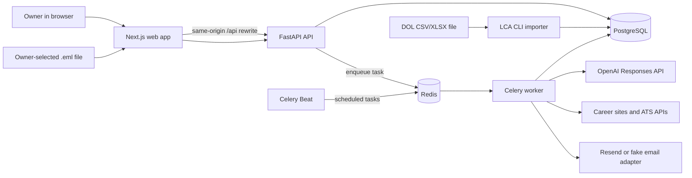
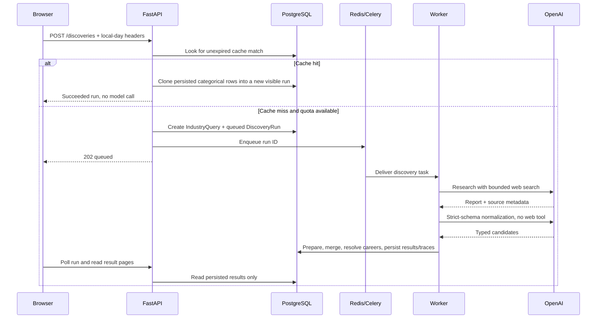
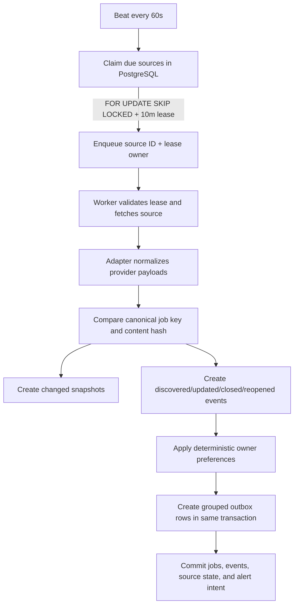
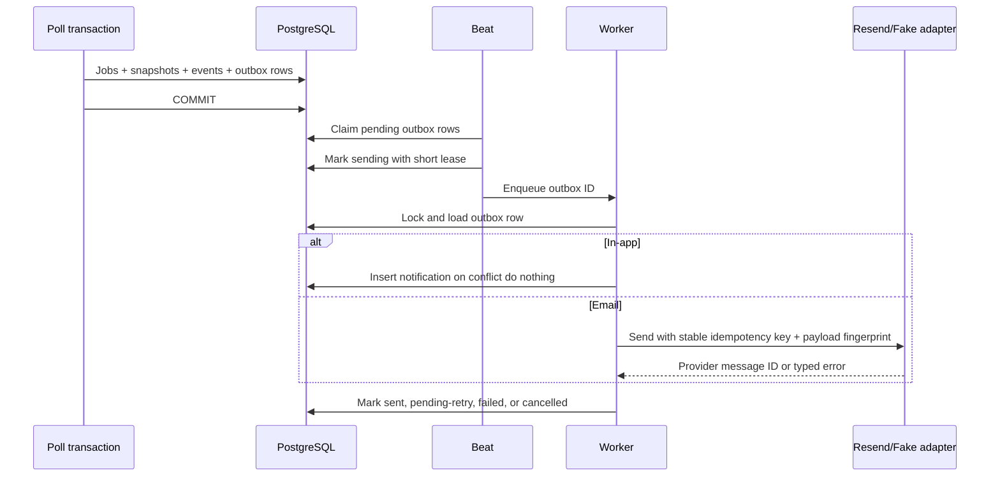

# JobScout AI: Architecture and Engineering Review

> Last reviewed: September 5, 2026. Reorganized September 18, 2026 for a reader
> who is comfortable with Python and Docker and is meeting the rest of the stack
> for the first time.
>
> This document is a learning map for taking ownership of the repository. It
> describes the code that exists now, the reasoning behind it, and the important
> limitations that remain. `DESIGN_DOC.md` is the product specification; when
> prose and implementation disagree, current code and Alembic migrations describe
> the behavior that actually runs.

---

## How to read this

The document is long because the system is real. You do not have to read it in
order, and you should not read it front to back on a first pass. Pick a path:

| If you want to…                          | Read                                                 | Roughly    |
| ---------------------------------------- | ---------------------------------------------------- | ---------- |
| Get oriented before touching anything    | Part 0, then Part 1, then Part 2                     | 25 minutes |
| Prepare to explain this project out loud | Part 0, Part 2, sections 7, 11, 12, then Part 6      | 45 minutes |
| Change some code safely                  | The Part 5 workflow you are touching, plus section 8 | as needed  |
| Know what is wrong with it               | Section 18, then section 17                          | 15 minutes |

**The one rule that explains most of the design:**

> PostgreSQL is the durable source of truth. Redis carries work that can be
> recreated. Workers may fail or receive the same task more than once, so durable
> state and idempotency rules are what make repeated execution safe.

If a later section confuses you, it is usually because one of the terms in
section 21 (the glossary, immediately below) has not landed yet. It is at the
front of this document on purpose.

A visual companion to Part 1 and Part 2 — the topology, the traced request, and
the two mechanisms worth explaining out loud — is published separately as
**Inside JobScout AI**: https://claude.ai/artifact/BotpEjdsRUsCeT8LYRkMZo

---

# Part 0 — Vocabulary first

Read this part before anything else. Every section after it assumes these words.

## 0. The tools, in one line each

Each of these has an equivalent you already understand from Python. Start there,
not from the tool's own documentation.

| Tool                | What it does here                                                                                                              | The Python idea it maps to                                          |
| ------------------- | ------------------------------------------------------------------------------------------------------------------------------ | ------------------------------------------------------------------- |
| **TypeScript**      | JavaScript plus type annotations, checked at build time and then stripped out. Nothing type-related survives into the browser. | Type hints, except `mypy` runs mandatorily before the code can ship |
| **React**           | Turns data into HTML and re-renders when that data changes                                                                     | A template engine that watches its own variables                    |
| **Next.js**         | A framework wrapped around React. Owns routing, server rendering, and runs its own Node server                                 | Flask or Django, but serving React pages                            |
| **Node.js**         | The runtime that executes JavaScript outside a browser                                                                         | CPython, but for JS                                                 |
| **FastAPI**         | The API framework: async, and it validates requests directly from type hints                                                   | Flask, but `async` and with validation built in                     |
| **Pydantic**        | Declares the shape of data and rejects anything that does not match                                                            | A dataclass that raises on the wrong type                           |
| **SQLAlchemy**      | Translates Python objects into SQL rows and back                                                                               | An ORM — `Job(...)` becomes `INSERT INTO jobs`                      |
| **Alembic**         | Versioned, replayable changes to the database schema                                                                           | `git`, but for table definitions                                    |
| **Celery**          | Runs a Python function later, in a separate process                                                                            | `threading`, except it survives a restart                           |
| **Celery Beat**     | Fires tasks on a fixed schedule                                                                                                | `cron`                                                              |
| **Redis**           | The mailbox Celery passes its messages through                                                                                 | A queue both processes can see                                      |
| **Tailwind CSS**    | Styling written as utility class names in the markup instead of a separate stylesheet                                          | inline styles, but composable and themeable                         |
| **Vitest / pytest** | The test runners for the frontend and backend respectively                                                                     | pytest, on both sides                                               |

Two things follow from that table and are worth fixing in your head now:

1. **TypeScript is not a runtime dependency.** It compiles to JavaScript. Delete
   it and the application still runs; you only lose compile-time checking.
2. **Celery and Redis exist for one reason:** so a slow call (OpenAI, a careers
   page) does not happen inside an HTTP request the browser is waiting on.

## 21. Glossary

| Term                 | Meaning in this repository                                                          |
| -------------------- | ----------------------------------------------------------------------------------- |
| Adapter              | Small provider-specific implementation behind a shared interface                    |
| Async task           | Work placed on Redis and executed later by Celery                                   |
| Baseline             | First trusted observation used to establish current state without normally alerting |
| Canonical key        | Stable identity used to recognize the same source/job across observations           |
| Complete observation | A source response trusted to represent its full current job set                     |
| Contract test        | Test that runs an adapter against recorded provider-shaped fixtures                 |
| DTO/schema           | Typed request, response, or AI-data shape validated with Pydantic                   |
| Idempotent           | Repeating an operation produces no unintended duplicate effect                      |
| Lease                | Expiring database ownership claim for one piece of work                             |
| Manifest             | Run-local list mapping stable source IDs to research URLs                           |
| Partial observation  | Useful additions/updates without enough information to infer absence/closure        |
| Poll                 | One attempt to observe a career source                                              |
| Snapshot             | Immutable representation of a job version                                           |
| Transactional outbox | Durable delivery intent committed with the business change that caused it           |
| Worker               | Background process consuming Celery tasks from Redis                                |

# Part 1 — The shape of the system

What the product is, which processes run, where the code lives, and the order
in which to read that code. Start here on a first pass.

## 1. What this system is

JobScout AI is a private, single-user application for an international student looking for US jobs.
It combines four related capabilities:

1. It asks OpenAI to research companies in an industry and produce structured, source-linked
   candidates.
2. It prepares and deduplicates broad company suggestions, then returns them alphabetically with
   categorical source, careers, monitoring, internship, and DOL facts.
3. It monitors saved companies' public career sources and records job changes over time.
4. It creates in-app and optional email alerts when a newly discovered job matches the owner's saved
   preferences.

The product is **local-first**. It has no accounts, login screen, tenant IDs, cloud database, or hosted
deployment. One installation represents one owner. Other people use separate installations with
separate databases.

This is more than an AI wrapper. The AI performs bounded research and returns proposals. Ordinary
application code owns persistence, identity preparation, careers validation, scheduling, retries, job lifecycle changes,
and notifications.

## 2. The shortest useful mental model



The key rule is:

> PostgreSQL is the durable source of truth. Redis carries work that can be recreated. Workers may
> fail or receive a task more than once, so durable state and idempotency rules must make repeated
> execution safe.

The major processes are:

| Process    | Responsibility                                           | Port or trigger       |
| ---------- | -------------------------------------------------------- | --------------------- |
| `web`      | Renders the interface and proxies `/api/*` to FastAPI    | `127.0.0.1:3000`      |
| `api`      | Validates HTTP requests and invokes domain services      | `127.0.0.1:8000`      |
| `worker`   | Runs discovery, polling, and notification tasks          | Consumes Redis tasks  |
| `beat`     | Periodically schedules due work                          | Writes tasks to Redis |
| `postgres` | Stores all durable application and audit state           | `127.0.0.1:5432`      |
| `redis`    | Celery broker/result backend and per-domain rate limiter | `127.0.0.1:6379`      |
| `migrate`  | Applies Alembic migrations when explicitly invoked       | Compose tools profile |

Although the design diagram uses logical research, polling, and notification queues, the current
Celery configuration does not define queue routing. All task types use Celery's default queue and the
single `worker` service. They are separated by task type and domain service, but not by physical queue.

## 4. Repository structure and ownership

```text
JobScout-AI/
├── apps/web/                    # Next.js application
│   ├── app/                     # Routes and root layout
│   ├── components/              # Feature and shared UI components
│   ├── lib/                     # API, local-day, and CSS-class helpers
│   └── tests/                   # Vitest + Testing Library tests
├── services/api/                # Python application
│   ├── alembic/                 # Database migration history
│   ├── app/api/routes/          # Thin FastAPI HTTP layer
│   ├── app/ai/                  # OpenAI adapter, schemas, workflow, pricing, fake
│   ├── app/companies/           # Company catalog and manual-save rules
│   ├── app/discovery/           # Discovery orchestration, validation, scoring
│   ├── app/monitoring/          # HTTP safety, adapters, scheduling, lifecycle
│   ├── app/notifications/       # Matching, rendering, email, transactional outbox
│   ├── app/assisted_sources/    # Source repair, reminders, and .eml imports
│   ├── app/immigration/         # DOL LCA importer and schemas
│   ├── app/profiles/            # Single-owner profile and preferences
│   ├── app/jobs/                # Cross-company job queries
│   ├── app/workers/             # Celery app, dispatchers, and thin task wrappers
│   ├── app/db/                  # SQLAlchemy models and session factories
│   └── tests/                   # Unit, contract, integration tests, and fixtures
├── docs/                        # API/data/privacy docs, ADR, and runbooks
├── evals/                       # Initial dataset; scorers/reports not implemented
├── infra/docker/                # API and web Dockerfiles
├── compose.yaml                 # Local multi-process topology
├── DESIGN_DOC.md                # Product/system specification
└── README.md                    # Setup and operator guide
```

The backend uses a domain-service architecture:

```text
FastAPI route -> Pydantic request -> domain service -> SQLAlchemy -> PostgreSQL
                                      |
                                      +-> enqueue a Celery task when work is slow
```

Routes should translate HTTP into method calls. Celery wrappers should translate broker messages
into method calls. Business rules belong in services and workflows. There is no separate repository
layer; each domain service owns its SQLAlchemy queries.

This structure is valuable because the same business logic can be called from an API route, worker,
CLI, or test without duplicating the rules in transport code.

## 20. Recommended learning order

Read and trace the repository in this order:

1. [`README.md`](README.md), [`compose.yaml`](compose.yaml), and
   [`app/main.py`](services/api/app/main.py) to learn the runtime topology.
2. [`app/db/models.py`](services/api/app/db/models.py) and
   [`docs/data-model.md`](docs/data-model.md) to learn the system's nouns and invariants.
3. [`discovery/service.py`](services/api/app/discovery/service.py),
   [`ai/client.py`](services/api/app/ai/client.py),
   [`ai/workflows/company_discovery.py`](services/api/app/ai/workflows/company_discovery.py), and
   [`discovery/validation.py`](services/api/app/discovery/validation.py) to trace one search.
4. [`monitoring/scheduling.py`](services/api/app/monitoring/scheduling.py),
   [`monitoring/polling.py`](services/api/app/monitoring/polling.py), and one provider adapter to trace
   one job observation.
5. [`notifications/service.py`](services/api/app/notifications/service.py) and
   [`notifications/email.py`](services/api/app/notifications/email.py) to understand delivery failure
   windows.
6. [`assisted_sources/service.py`](services/api/app/assisted_sources/service.py) to compare automated,
   partial, and owner-assisted observations.
7. [`apps/web/lib/api.ts`](apps/web/lib/api.ts) and one complete feature component to connect browser
   state to the API.
8. The relevant unit, contract, and integration test beside each service. Tests often express the
   intended invariant more clearly than comments.

For each workflow, draw this state progression yourself:

```text
owner action -> HTTP request -> service transaction -> queued task -> external call
             -> normalized result -> database state transition -> user-visible result
```

Then identify what happens on validation failure, network failure, duplicate delivery, process death,
and owner retry. Once you can explain those paths without reading the README, you understand the
architecture rather than merely knowing its feature list.

# Part 2 — Follow one request end to end

Everything in Part 1 is a map. This part is a single journey across it. If you
read only one part of this document, read this one — it is the version of the
system you can explain out loud.

## Tracing a search: browser to database and back

You type "gaming companies" into the search box and press enter. Here is every
hop it makes, with the file that handles it.

**1. React catches the submit** — `apps/web/components/discovery/discovery-search.tsx:22`

Your typed text is held in React state (`useState`), which is why the field
updates as you type without reloading the page. Pressing enter calls `submit()`.

**2. The shared API helper runs** — `apps/web/lib/api.ts`

One function, `apiRequest<T>()`, is used by all twelve feature components. It adds
JSON headers, attaches the browser-computed local-day headers, and converts the
backend's error envelope into a typed `ApiError`. Because it exists, no component
writes raw `fetch` boilerplate.

**3. Next.js proxies the call** — `apps/web/next.config.ts`

The browser asks its _own_ origin for `/api/v1/discoveries`. The Next.js Node
server rewrites that to `http://127.0.0.1:8000`. The browser never addresses
FastAPI directly.

> This is why the repository contains no CORS configuration anywhere. To the
> browser it is all one origin. If you ever remove Next.js, you have to add CORS.

**4. FastAPI takes over** — `services/api/app/api/routes/discoveries.py:33`

Before any of your code runs, FastAPI has already parsed the JSON body into a
`DiscoveryCreate` Pydantic model (rejecting bad input with a `422`), opened a
database session through dependency injection, and validated the local-day
headers. You never wrote parsing code — that is what "validation from type hints"
means in practice.

**5. The service layer decides** — `services/api/app/discovery/service.py`

Checks the daily run quota, looks for a cached result from the last seven days,
and if there is no cache hit, writes a `DiscoveryRun` row with `status="queued"`
through SQLAlchemy.

**6. The pivot** — `services/api/app/workers/dispatch.py:8`

```python
run_company_discovery.delay(str(run_id))
```

`.delay()` does **not** run the function. It drops a message into Redis saying
"somebody should run this, with this ID" and returns immediately. Almost every
architectural decision in this repository follows from this one line.

**7. FastAPI answers — already**

It returns `202 Accepted` with the run's `id`. Elapsed time: milliseconds. The
research has not started. The browser navigates to `/discover/<id>`.

**8. A different container wakes up** — `services/api/app/workers/tasks.py:35`

A Celery worker has been sitting idle watching Redis. It picks up the message and
calls:

```python
def run_company_discovery(run_id: str) -> None:
    """Thin task wrapper; the typed workflow owns all domain behavior."""
    asyncio.run(_run_company_discovery_guarded(UUID(run_id)))
```

The task does nothing except bridge Celery's synchronous world into async code.
All the real behavior — calling OpenAI, validating proposals, resolving careers
pages, scoring, persisting rows — lives in `CompanyDiscoveryWorkflow`. Section 9
covers that workflow in full.

**9. The browser finds out by asking again** — `apps/web/components/discovery/discovery-results.tsx:116`

The results page polls `GET /discoveries/<id>` every two seconds and stops once
the status leaves `queued`/`running`. There are no websockets; it simply asks
repeatedly.

## The same trace, as one sentence

> FastAPI answers immediately and hands slow work to Celery through Redis;
> workers finish it afterwards; PostgreSQL is the only thing that remembers
> anything.

## What breaks if you remove each piece

This is the question behind "why did you choose X?" — it is really asking what X
is load-bearing for.

| Remove                  | And this breaks                                                                                                                 |
| ----------------------- | ------------------------------------------------------------------------------------------------------------------------------- |
| Redis                   | Celery has no mailbox. `.delay()` fails and the API cannot hand work off at all.                                                |
| Celery                  | Discovery runs inside the HTTP request. A 40-second OpenAI call becomes a 40-second hanging request that times out.             |
| Celery Beat             | Nothing polls on a schedule. Monitoring happens only when someone clicks "Poll now".                                            |
| PostgreSQL (for SQLite) | No `SELECT ... FOR UPDATE SKIP LOCKED`, so concurrent workers cannot safely claim work. Also loses JSONB and check constraints. |
| Next.js                 | Needs a separate static host, CORS configured on FastAPI, and the `/api` proxy disappears.                                      |
| TypeScript              | Nothing at runtime. It is compile-time only and type-erases to JavaScript.                                                      |

# Part 3 — How each layer works

Now that you have followed one request through the whole stack, here is each
layer on its own terms: the browser, the API process, the background workers,
and the way time is handled across all three.

## 5. Frontend architecture

### 5.1 Routes

| Browser route            | Main responsibility                                                            |
| ------------------------ | ------------------------------------------------------------------------------ |
| `/`                      | Explains the product and local-first boundary                                  |
| `/onboarding`            | Creates/updates the single profile and settings                                |
| `/discover`              | Starts industry research and shows current-day history                         |
| `/discover/[runId]`      | Polls an async discovery and renders persisted result pages                    |
| `/companies`             | Manually resolves, confirms, lists, pauses, resumes, and removes companies     |
| `/companies/[companyId]` | Shows source health, company jobs, source repair, reminders, and `.eml` import |
| `/jobs`                  | Lists collected jobs across saved companies                                    |
| `/alerts`                | Shows in-app alerts, reminders, email configuration, and delivery history      |
| `/settings`              | Edits profile, matching, baseline-alert, and email settings                    |

Most route files are small server-component wrappers around client components. The feature
components hold local state and call the API directly.

### 5.2 API communication

The browser calls `/api/v1/...` on the Next.js origin. `next.config.ts` rewrites that request to the
FastAPI service. This keeps browser traffic same-origin and avoids a separate CORS configuration.

`apps/web/lib/api.ts`:

- adds JSON headers when a body is present;
- adds browser-computed local-day headers for cost-sensitive discovery requests;
- parses the backend's stable error envelope;
- throws `ApiError` with a public code, message, and details;
- trusts successful JSON as the caller's TypeScript type.

There is no centralized server-state cache. Components independently implement loading, polling,
pagination, mutation, error, and success states. This keeps the dependency list small but has already
created inconsistent failure/refresh behavior in some screens.

### 5.3 Styling and accessibility

Tailwind utilities and shared CSS classes implement a responsive dark interface. Native labels,
buttons, headings, `role="alert"`, `role="status"`, focus styles, and `aria-busy` appear throughout the
main flows. No automated accessibility audit or real-browser WCAG pass exists yet.

Next.js sends `X-Content-Type-Options`, `Referrer-Policy`, `X-Frame-Options`, and a Content Security
Policy. The CSP still permits inline scripts and styles, so it should not be presented as a fully
hardened policy.

## 6. Backend request architecture

`app/main.py` creates one FastAPI application and mounts every router under `/api/v1`. A request that
needs the database receives an `AsyncSession` through FastAPI dependency injection. The API process
uses a normal async connection pool because it runs on one long-lived event loop.

Pydantic validates request/response objects. Expected domain failures raise `AppError` with a stable
code and safe message. Pydantic validation failures and unexpected exceptions are converted to the
same response shape:

```json
{
  "error": {
    "code": "STABLE_ERROR_CODE",
    "message": "Safe explanation for the owner.",
    "details": {}
  }
}
```

The main API families are:

- `/profile` and `/settings`: singleton owner data and deterministic job filters;
- `/discoveries`: queue, poll, paginate, hide/show, continue, and save research;
- `/companies` and `/saved-companies`: catalog resolution and explicit ownership decisions;
- `/jobs`: cross-company and per-company job queries;
- `/notifications` and `/email`: alerts and delivery management;
- `/ops`: import history, source runs, manual polling, and source pausing;
- source-repair, review-reminder, and email-import endpoints;
- `/health/live` and `/health/ready`: process and dependency health.

See [`docs/api.md`](docs/api.md) for the endpoint-by-endpoint contract.

## 7. Background-work architecture

Slow, scheduled, or externally dependent work does not run inside an API request:

- company discovery calls OpenAI and verifies career pages in a worker;
- source polling calls ATS or public career sites in a worker;
- notification delivery calls Resend or the fake adapter in a worker;
- Celery Beat periodically finds work that has become due.

Beat currently schedules:

| Frequency        | Task                                           |
| ---------------- | ---------------------------------------------- |
| Every 60 seconds | Worker heartbeat                               |
| Every 60 seconds | Claim and enqueue due career sources           |
| Every 30 seconds | Claim and enqueue due notification outbox rows |
| Every 60 seconds | Create notifications for due review reminders  |

Celery uses late acknowledgements, rejects work when a worker is lost, and prefetches one task per
worker slot. This supports at-least-once delivery: a crash may cause the same task to arrive again.
Application/database idempotency therefore matters more than broker-level “exactly once” claims.

The Celery tasks are synchronous wrappers that call `asyncio.run()` for async domain services. A
worker-specific SQLAlchemy engine uses `NullPool`, so an asyncpg connection created on one task's
event loop cannot be accidentally reused by a later task's different loop. The FastAPI engine keeps
normal pooling.

## 15. Time design

The project deliberately separates two ideas:

- **Durable system time:** database timestamps, leases, backoff, polling intervals, cache expiry, and
  outbox scheduling use timezone-aware UTC instants or elapsed durations.
- **Owner's calendar day:** the browser computes local midnight boundaries and sends them as UTC
  instants for daily history and the uncached-search quota.

This avoids storing a timezone that can become stale when the owner travels or changes system
settings. It also handles 23-hour and 25-hour daylight-saving days. The UI formats server timestamps
with the browser's current locale and timezone.

# Part 4 — The data

Twenty-four tables sounds like a lot until you see that most of them exist to
answer a different question about the same job posting. This is the part that
repays careful reading — the nouns here are the system.

## 8. Data model: what each record means

Understanding these distinctions is the fastest way to understand the system.

### 8.1 Owner and preferences

| Table/model                       | Meaning                                                                |
| --------------------------------- | ---------------------------------------------------------------------- |
| `owner_profiles` / `OwnerProfile` | The one local person's display name, email, and country                |
| `app_settings` / `AppSettings`    | Role types, keywords, locations, remote preference, and alert settings |

Both tables enforce a singleton key. There is no `user_id` column because V1 is intentionally not a
multi-user product.

### 8.2 Discovery and company catalog

| Table/model                                     | Meaning                                                                         |
| ----------------------------------------------- | ------------------------------------------------------------------------------- |
| `industry_queries` / `IndustryQuery`            | One paid or potentially paid research input; owns cache identity and expiration |
| `discovery_runs` / `DiscoveryRun`               | One user-visible execution, including cache hits and continuations              |
| `companies` / `Company`                         | Canonical company identity shared across discoveries                            |
| `company_aliases` / `CompanyAlias`              | Brand/legal-name alternatives used for matching and provenance                  |
| `company_legal_entities` / `CompanyLegalEntity` | Conservative links from a company to DOL employer names                         |
| `company_industries` / `CompanyIndustry`        | Company-to-industry link plus careers, opening, and DOL metadata                |
| `company_evidence` / `CompanyEvidence`          | Auditable evidence records                                                      |
| `discovery_results` / `DiscoveryResult`         | Categorical discovery snapshot connecting a run to a company                    |
| `saved_companies` / `SavedCompany`              | The owner's explicit decision to monitor a company                              |
| `ai_runs` / `AiRun`                             | Per-call model, usage, cost estimate, sources, status, and trace data           |

A `Company` existing in the catalog does not mean the owner saved it. `SavedCompany` is the explicit
boundary that activates recurring monitoring and alert rules.

### 8.3 Sponsorship data

| Table/model                                                | Meaning                                                                  |
| ---------------------------------------------------------- | ------------------------------------------------------------------------ |
| `immigration_dataset_imports` / `ImmigrationDatasetImport` | Provenance, hash, layout, counts, and status for one imported DOL file   |
| `lca_employer_yearly_stats` / `LcaEmployerYearlyStat`      | Aggregated employer/year sponsorship counts, not applicant-level records |

Only conservative exact or owner-verified legal-entity mappings contribute to a company's displayed
sponsorship facts. “Unresolved” means the system cannot safely connect the names; it does not mean the
company has no sponsorship history.

### 8.4 Monitoring and job history

| Table/model                                    | Meaning                                                                        |
| ---------------------------------------------- | ------------------------------------------------------------------------------ |
| `career_sources` / `CareerSource`              | Canonical source identity, provider configuration, schedule, lease, and health |
| `career_source_repairs` / `CareerSourceRepair` | Preview/confirmation audit trail for replacing a source                        |
| `source_poll_runs` / `SourcePollRun`           | One attempted observation and its completeness/counters/errors                 |
| `jobs` / `Job`                                 | Current materialized state of a job                                            |
| `job_snapshots` / `JobSnapshot`                | Immutable content versions observed over time                                  |
| `job_events` / `JobEvent`                      | Immutable discovered/updated/closed/reopened events                            |
| `email_alert_imports` / `EmailAlertImport`     | Provenance and result counts for one owner-uploaded `.eml` observation         |
| `review_reminders` / `ReviewReminder`          | Scheduled manual checks for sources automation cannot monitor reliably         |

`Job` answers “what does this posting look like now?” `JobSnapshot` answers “what exact versions did
we observe?” `JobEvent` answers “what meaningful transitions occurred?” Those are three different
questions, so three records are appropriate.

### 8.5 Notifications

| Table/model                                  | Meaning                                                   |
| -------------------------------------------- | --------------------------------------------------------- |
| `notification_outbox` / `NotificationOutbox` | Durable intent to deliver an in-app or email notification |
| `in_app_notifications` / `InAppNotification` | Materialized local notification shown to the owner        |

Database unique constraints enforce important invariants: one saved record per company, one job key
per source, one snapshot per content hash, one event per dedupe key, and one outbox row per
channel/event group.

### 8.6 Key state machines

State values are constrained in PostgreSQL rather than being arbitrary strings:

```text
IndustryQuery: pending -> running -> succeeded | failed
DiscoveryRun:  queued  -> running -> succeeded | failed

CareerSource:
  pending_resolution -> supported -> degraded
  supported/degraded  -> paused
  unsupported/paused  -> supported through an explicit recovery action
  replaced source     -> retired
  owner email source  -> assisted

SourcePollRun: running -> succeeded | partial | failed | not_modified
Job:           active  -> closed -> active (reopened)
Outbox:        pending -> sending -> sent | failed | cancelled
```

These diagrams describe common transitions, not permission for every possible direct transition.
The service methods and database constraints together define the actual rules.

# Part 5 — The six workflows

Each of these is a complete feature path from user action to stored result.
Read the one you are about to change; skim the rest. They assume Part 3 and
Part 4.

## 9. Company-discovery workflow

### 9.1 Request, cache, and quota



The cache identity contains normalized query, country, both configured model IDs, and prompt version.
The default cache lifetime is seven days. A cache hit creates a new visible `DiscoveryRun` and clones
persisted result rows, but it creates no new `IndustryQuery` and spends no model tokens.

New uncached research is limited to five runs per browser-local calendar day by default. Failed runs
count because they may already have spent tokens. The browser sends the exact UTC instants for local
midnight and the next local midnight; the server accepts 22–26 hour ranges so daylight-saving changes
work without storing a timezone preference.

### 9.2 The AI boundary

Each uncached run makes two OpenAI Responses API calls, with one optional normalization repair:

1. **Research call:** OpenAI may use web search and returns a prose report plus source metadata.
2. **Normalization call:** web tools are disabled; the model must transform that report and source
   manifest into the strict Pydantic-generated JSON schema.
3. **Repair call:** one additional normalization attempt is allowed when structured output is invalid.

Manifest URLs receive stable run-local IDs such as `source_7`. The normalized proposal cites those
IDs instead of freely inventing careers URLs. Application code resolves IDs against the manifest,
sanitizes website identity anchors, merges duplicate companies, and classifies careers support. A
manifest match is diagnostic and never controls company inclusion.

This is the intended authority split:

| AI may propose                     | Deterministic code decides                               |
| ---------------------------------- | -------------------------------------------------------- |
| Industry interpretation            | Whether request/quota/cache rules allow a run            |
| Company candidates and explanation | Safe domain-or-name identity and duplicate merging       |
| Source references                  | Matched/unmatched diagnostic state                       |
| Careers source ID                  | Careers acceptance, inspection, and monitoring support   |
| Legal-entity suggestions           | Whether exact or owner-verified DOL names can contribute |
| Internship-reported flag           | Persistence as an explicitly AI-reported claim           |

The current implementation is not proof that every sourced claim is true. Manifest membership proves
that a URL appeared in the model's research output; it does not prove that the page says what the
model claims.

### 9.3 Careers-page resolution

Generic same-domain careers URLs are examined by bounded deterministic code. It can identify an
embedded supported ATS board, count real job-detail links, and follow at most one likely listing link.
A listing-free page becomes unsupported. Network failure keeps the candidate unresolved rather than
failing the entire discovery.

Recognized Greenhouse, Lever, Ashby, and SmartRecruiters URLs are treated as structured without this
generic-page fetch. That is efficient, but the current validation does not prove that a selected
third-party board belongs to the proposed company; this is a known correctness gap described later.

### 9.4 Scoreless discovery contract

Discovery has no opportunity, relevance, confidence, or component scores. Results expose raw opening
counts, matched/unmatched research state, AI-reported internship state, careers inspection state,
monitoring support, and exact-name DOL filing counts. The API orders the combined series by
case-insensitive company name and UUID.

### 9.5 Results, continuations, and saving

The frontend polls until the root run succeeds or fails, then automatically drains bounded persisted
result pages. Merely reading more persisted results never calls OpenAI.

“Research more” creates an uncached continuation attached to the root run. It requires an explicit
usage acknowledgement, consumes the same daily quota, asks the model to exclude earlier companies,
and deterministically rejects repeated official domains in the series.

Hiding a result changes only its run-specific visibility. **Save and confirm** creates or reactivates a
`SavedCompany`, activates eligible sources, and makes them due for recurring polling. Saving all
monitorable results excludes hidden and unsupported results.

## 10. Manual company workflow

The owner can supply a company name and an HTTPS careers URL without using AI.

1. `CompanyService.resolve()` normalizes the URL and deterministically detects the provider.
2. It reuses a canonical existing source/company when possible, finds local name matches, or creates
   a proposed company and source.
3. The UI presents the proposal for review. Resolving alone does not save it.
4. The owner explicitly confirms the save.
5. Saving marks the company verified, creates/updates `SavedCompany`, activates its source, and can
   optionally enable first-poll alerts.

Provider detection extracts canonical identities such as a Greenhouse board token, Lever site,
Ashby organization, or SmartRecruiters company identifier. An unrecognized HTTPS page becomes a
pending generic source and receives a bounded first poll.

## 11. Monitoring and job-lifecycle workflow



### 11.1 Scheduling and source safety

`SourceScheduler` selects active saved companies whose sources are due and unleased. PostgreSQL row
locks with `SKIP LOCKED` let multiple schedulers claim different rows. A random-looking lease owner
token identifies the claim. Successful polls schedule the next run at the configured interval plus a
stable 0–10 minute source-specific jitter. Failures use exponential backoff capped at 24 hours, and a
source becomes degraded after ten consecutive failures.

`SafeHttpClient` requires HTTPS, rejects credentials and unusual ports, resolves DNS, rejects private
or otherwise unsafe addresses, validates every redirect, limits redirects/retries, streams bounded
responses, and uses a Redis per-domain rate limiter. The generic adapter checks `robots.txt` before
fetching a career page.

### 11.2 Adapter completeness

| Source                       | Observation completeness          | May close missing jobs?            |
| ---------------------------- | --------------------------------- | ---------------------------------- |
| Greenhouse API               | Full                              | Yes, after two qualifying absences |
| Lever API                    | Full                              | Yes, after two qualifying absences |
| Ashby API                    | Full                              | Yes, after two qualifying absences |
| SmartRecruiters API          | Full, including all pages/details | Yes, after two qualifying absences |
| Generic server-rendered HTML | Partial                           | No                                 |
| Owner-uploaded `.eml`        | Partial                           | No                                 |
| Manual reminder              | No job observation                | No                                 |

“Full” means the adapter believes it observed the provider's complete current job set. “Partial” means
it may have found valid jobs but cannot conclude that an absent job disappeared.

### 11.3 Identity, snapshots, and events

A normalized job gets a provider/company-specific canonical key. Stable provider IDs are preferred;
URLs and normalized fields provide fallbacks. A content hash represents material job fields.

- New key: create `Job`, `JobSnapshot`, and a `discovered` event.
- Existing key with a new hash: update current job, add a snapshot, and create `updated`.
- Closed job seen again: mark active and create `reopened`.
- Active job absent from one successful full poll: increment `consecutive_absences`.
- Active job absent from a second consecutive successful full poll: close and create `closed`.
- Failed, partial, malformed, or HTTP 304 observations never advance absence toward closure.

The first successful observation establishes a baseline and normally stays silent. The owner may opt
into alerts for already-open jobs when saving or replacing a source.

## 12. Matching and notification architecture

Job matching is deterministic; it makes no per-job AI request. A job must:

- have a selected classified role type;
- contain none of the excluded keywords;
- contain at least one required keyword when the required list is non-empty;
- satisfy remote/work-arrangement and preferred-location rules.

All matching `discovered` and `reopened` jobs from one company and poll share one event-group key.
The polling transaction writes one in-app outbox row and, when enabled, one email outbox row. If the
poll transaction rolls back, its alert intents roll back too.



Transient email errors retry with bounded backoff and a five-attempt cap. Permanent errors stop.
Disabling email or removing the destination cancels pending delivery rather than pretending it sent.
The fake adapter exercises the same outbox path without network calls. A `sent` Resend row means the
provider accepted the request; the application has no webhook proving inbox delivery.

## 13. Source recovery and assisted observations

### 13.1 Source replacement

Replacing a broken source is a two-step owner-confirmed workflow:

1. Preview normalizes a direct supported ATS URL, detects its canonical provider identity, checks
   cross-company conflicts, chooses an action, and stores a preview that expires after 15 minutes.
2. Confirm locks the preview, reruns deterministic checks, and updates, reuses, reactivates, or creates
   the replacement.

If the old source already has jobs or poll history, it is retired rather than overwritten. This
preserves the audit trail. The replacement starts with its own quiet baseline unless the owner chose
current-job alerts.

### 13.2 Manual review reminders

For an unsupported source, the owner schedules a local date/time. The browser converts it to an
absolute instant. Beat scans due reminders, and each reminder schedule version can create one in-app
notification. Checking or dismissing the reminder records the owner's action; it never pretends that
an automated poll occurred.

### 13.3 `.eml` imports

An owner may upload one RFC 822 email up to 1 MiB. The parser:

- ignores attachments and non-text MIME parts;
- parses plain text and HTML locally without loading remote resources;
- extracts plausible HTTP(S) job links and canonicalizes them;
- retains only bounded text, safe metadata, hashes, and normalized candidates;
- uses Message-ID or content SHA-256 to reject duplicate imports.

Imported jobs use a special assisted career source and a partial poll record. They can create, update,
or reopen jobs, but can never close an absent job.

## 14. DOL sponsorship-data workflow

The DOL importer is a CLI rather than an API upload. The owner downloads an official LCA disclosure
CSV/XLSX file and provides its fiscal year, source URL, and layout version.

The importer validates the file, hashes it, parses records off the async event loop, normalizes legal
employer names, aggregates counts and top occupations, and commits the aggregate rows with the
successful import state. The same year/hash combination is idempotent.

Company discovery considers only exact or owner-verified legal-entity mappings. It displays loaded
years and labels unresolved mappings honestly. Historical LCA activity is evidence of past filings,
not a promise that a particular role will sponsor a particular applicant.

# Part 6 — Quality, risk, and what is actually broken

How the system is verified, what it promises about privacy and safety, and an
honest list of what does not work yet. Section 18 is the most useful section
in this document to have read before anyone asks you about the project.

## 17. Testing and CI

### 17.1 Test layers

| Layer               | What it proves                                                                              | What it does not prove                              |
| ------------------- | ------------------------------------------------------------------------------------------- | --------------------------------------------------- |
| Backend unit        | Pure validation, scoring, parsing, matching, safety, and error rules                        | Database/service integration                        |
| Backend contract    | Adapters understand recorded provider/email fixtures                                        | Current live provider behavior                      |
| Backend integration | Services, migrations, PostgreSQL, Redis, lifecycle, outbox, and API contracts work together | Real browser flow or strong race/load behavior      |
| Frontend component  | Rendered states and mocked API interactions behave as expected                              | Next.js + FastAPI + worker + DB as one real journey |
| AI dataset contract | Dataset has expected structure and review targets                                           | Actual model accuracy                               |

Backend tests force fake email configuration and use fakes/fixtures for OpenAI and career sources.
They never intentionally spend money or call live external providers.

### 17.2 GitHub Actions CI

CI runs on every push and pull request in two independent jobs:

**Web job**

1. Check out the repository.
2. Install pinned pnpm and Node versions.
3. Install the locked dependency graph.
4. Check Prettier formatting.
5. Run ESLint.
6. Run TypeScript checking.
7. Run Vitest.
8. Build the production Next.js application.

**API job**

1. Start disposable PostgreSQL 16 and Redis 7 services.
2. Install Python 3.12, uv, and locked dependencies.
3. Check Ruff formatting/linting and strict mypy types.
4. Upgrade a blank database through the full Alembic chain.
5. Check that SQLAlchemy models do not imply an uncommitted migration.
6. Run pytest with database integration tests enabled.

This is continuous integration, not continuous deployment. Nothing in this workflow publishes or
hosts the application.

During the repository review immediately before this document was created, 219 backend unit/contract
tests and 32 frontend tests passed; Ruff, mypy, ESLint, and TypeScript checks also passed. The complete
database integration suite and production build were not rerun in that review. The repository-wide
Prettier check failed on three existing files, so the hosted web CI job will remain red until those
formatting differences are fixed and pushed.

## 16. Security and privacy design

The security model begins with a local network boundary:

- Compose publishes web, API, PostgreSQL, and Redis only on `127.0.0.1`;
- the API refuses non-loopback host configuration unless `ALLOW_REMOTE_ACCESS=true`;
- the application has no authentication, so that override does not make public hosting safe;
- OpenAI and Resend keys stay in server-side environment variables;
- `.env` is ignored while `.env.example` documents names;
- API errors avoid returning internal exception details;
- external HTML is parsed as text instead of rendered as trusted markup;
- outbound source requests have SSRF, redirect, size, timeout, retry, robots, and rate-limit controls;
- imported email content is bounded and never loads external resources;
- notification payloads exclude the owner's email address and API keys.

Treat “localhost-only” as a product constraint, not as a temporary deployment setting. Supporting
remote users would require authentication, authorization, CSRF/origin/host protections, TLS,
per-user data ownership, secret management, deployment operations, and a new architecture decision.

## 18. Important current limitations and bugs

These are part of understanding the architecture. Owning a system means knowing where its guarantees
end.

### 18.1 High-priority correctness and reliability issues

1. **A structured ATS board is not proven to belong to its proposed company.**
   `discovery/validation.py` immediately accepts a recognized Greenhouse/Lever/Ashby/
   SmartRecruiters URL as structured. A model proposal can combine Company A's website evidence with
   Company B's valid ATS board; the structured board bypasses generic resolution and can be saved
   under Company A. Manifest membership is therefore stronger than an invented URL, but weaker than
   verified employer ownership.

2. **A hard-killed discovery worker can leave a run permanently `running`.**
   The workflow commits `running` before paid calls. A redelivered task returns early unless the run
   is still `queued`, and Beat has no stale-discovery watchdog. Ordinary Python exceptions are marked
   failed; process termination between commits is the problematic case. Recovery must avoid blindly
   repeating possibly paid research.

3. **Polling verifies a lease only before external I/O.**
   A slow worker can outlive its lease. The implementation does not recheck/fence ownership before
   applying results and clearing the lease, so stale work can interfere with a newer claim or an
   owner pause. The scheduler's `SKIP LOCKED` claim is good, but it does not protect the entire
   fetch-and-commit interval.

4. **SSRF DNS validation has a check/use gap.**
   The HTTP layer validates DNS results, discards those addresses, and lets HTTPX independently
   resolve the original hostname when connecting. DNS can theoretically change between validation
   and connection. The connection should be tied to a validated address while preserving the proper
   TLS hostname, or use a transport with equivalent enforcement.

### 18.2 Product and frontend issues

1. An initial failure loading a discovery run stores an error but renders the earlier `!run`
   “Loading research…” branch forever, with no retry control.
2. Settings use `Promise.allSettled()` and silently ignore failed reads. A transient settings-read
   failure can expose defaults and overwrite existing preferences on the next save.
3. The global jobs screen requests only 100 records and ignores `next_cursor`. Its backend query
   orders by random UUIDv4 ID instead of `first_seen_at`, so it is not reliably the newest 100.
4. Successful `.eml` import refreshes import history but does not refresh the adjacent job list.
5. Saved-company pagination metadata is currently ignored by the frontend.
6. Frontend API response types are handwritten and not runtime-validated or generated from OpenAPI.

### 18.3 Missing proof and unfinished hardening

- No Playwright or other real-browser end-to-end suite exists.
- No AI scorer/report measures company precision, careers-URL accuracy, unsupported claims, cost, or
  latency. The 20-query dataset test checks shape, not model quality.
- Concurrency tests mainly perform sequential repeated calls; they do not strongly simulate racing
  workers and competing transactions.
- No load test verifies the documented 500-company/1,000-source/100,000-job target.
- OpenTelemetry and Prometheus packages are installed, but no instrumentation or exported metrics
  exist. Structured logs and database traces are the current observability.
- AI fields named `redacted_input`/`redacted_output` currently store the raw industry query, a bounded
  research excerpt, and normalized output. No real redaction policy/test exists.
- There is no browser operations page, full local-data reset flow, or completed accessibility pass.
- API mutations do not accept client idempotency keys. Domain-specific database uniqueness handles
  several repeated operations, but there is no general request-idempotency contract.
- ~~The latest repository-wide Prettier check fails in
  `apps/web/components/discovery/daily-history.tsx`,
  `apps/web/components/discovery/discovery-search.tsx`, and
  `apps/web/tests/daily-history.test.tsx`.~~
  **Resolved 2026-09-17** (commit `36732f6`): `pnpm format` was run and the full web
  CI chain — `format:check`, `lint`, `typecheck`, `test`, `build` — now passes.

### 18.4 Installed but currently unused pieces

- `opentelemetry-api` and `opentelemetry-sdk`;
- `prometheus-client`;
- `OTEL_EXPORTER_OTLP_ENDPOINT` setting;
- `@radix-ui/react-slot`;
- `class-variance-authority`.

Unused direct dependencies should either receive an implemented purpose or be removed. Their presence
does not count as an implemented feature.

# Part 7 — Reference

Look-up material. The dependency inventory is here rather than at the front
because a list of package versions teaches nothing until you know what the
packages are for.

## 3. Complete technology inventory

This inventory includes every direct runtime/development dependency declared in the repository,
the infrastructure tools, and the external integrations used by the code. It intentionally does not
enumerate hundreds of transitive packages pulled in by those direct dependencies; those exact
dependency graphs are recorded in `pnpm-lock.yaml` and `services/api/uv.lock`.

### 3.1 Languages and runtimes

| Technology     | Version           | Role                                                                     |
| -------------- | ----------------- | ------------------------------------------------------------------------ |
| Python         | `3.12`            | API, workers, domain services, adapters, CLI importer, and backend tests |
| TypeScript     | `5.9.3`           | Frontend application and frontend tests; strict mode is enabled          |
| Node.js        | `22.13+`          | Next.js build and runtime                                                |
| HTML/CSS       | Browser standards | Page structure and styling                                               |
| SQL/PostgreSQL | PostgreSQL 16     | Durable relational state, constraints, locks, and JSONB evidence         |

### 3.2 Frontend runtime libraries

Declared in [`apps/web/package.json`](apps/web/package.json):

| Library/framework        | Version   | How it is used                                                                         |
| ------------------------ | --------- | -------------------------------------------------------------------------------------- |
| Next.js                  | `16.3.3`  | App Router, page/layout structure, production build, API rewrite, and security headers |
| React                    | `19.2.8`  | Client components, local state, effects, forms, and rendering                          |
| React DOM                | `19.2.8`  | Browser rendering for React                                                            |
| Tailwind CSS             | `4.3.3`   | Utility-first styling, loaded through `globals.css`                                    |
| Lucide React             | `0.468.0` | Icons such as search, alert, building, spinner, and external-link icons                |
| `clsx`                   | `2.1.1`   | Conditional CSS class construction                                                     |
| `tailwind-merge`         | `3.3.1`   | Resolves conflicting Tailwind class names in the `cn()` helper                         |
| Radix UI Slot            | `1.2.3`   | Declared dependency; no current source import was found                                |
| Class Variance Authority | `0.7.1`   | Declared dependency; no current source import was found                                |

The frontend does not use Redux, Zustand, React Query, a form library, an OpenAPI-generated client,
or runtime schema validation such as Zod. Feature components use `useState`/`useEffect` and a small
handwritten `apiRequest<T>()` wrapper. The generic `T` is a TypeScript assertion; it does not validate
server JSON at runtime.

### 3.3 Backend runtime libraries

Declared in [`services/api/pyproject.toml`](services/api/pyproject.toml):

| Library/framework         | Declared range | How it is used                                                                       |
| ------------------------- | -------------- | ------------------------------------------------------------------------------------ |
| FastAPI                   | `>=0.115,<1`   | Versioned REST API, dependency injection, request/response schemas, and OpenAPI docs |
| Uvicorn                   | `>=0.34,<1`    | ASGI server for FastAPI                                                              |
| Pydantic                  | `>=2.10,<3`    | API DTOs, strict AI structured-output schemas, and field validation                  |
| Pydantic Settings         | `>=2.7,<3`     | Typed `.env` and process-environment configuration                                   |
| SQLAlchemy async          | `>=2.0.36,<3`  | ORM models, queries, transactions, row locks, and async sessions                     |
| asyncpg                   | `>=0.30,<1`    | Async PostgreSQL driver used by SQLAlchemy                                           |
| Alembic                   | `>=1.14,<2`    | Explicit, versioned database migrations                                              |
| Celery with Redis support | `>=5.4,<6`     | Background tasks and periodic scheduling integration                                 |
| redis-py                  | `>=5.2,<7`     | Redis client and distributed per-domain request limiting                             |
| HTTPX                     | `>=0.28,<1`    | OpenAI, Resend, ATS, robots, and generic-page HTTP requests                          |
| AnyIO                     | `>=4.8,<5`     | Async filesystem checks and thread offloading in the DOL importer                    |
| OpenPyXL                  | `>=3.1,<4`     | Streaming DOL LCA `.xlsx` imports                                                    |
| structlog                 | `>=24.4,<26`   | Structured JSON application and worker logs                                          |
| OpenTelemetry API/SDK     | `>=1.29,<2`    | Installed but not instrumented in current application code                           |
| Prometheus Client         | `>=0.21,<1`    | Installed but not instrumented in current application code                           |

There is no OpenAI Python SDK and no Resend SDK. Both integrations are deliberately small typed
adapters implemented over HTTPX. This reduces dependency surface but makes the repository responsible
for request/response parsing and future API compatibility.

The backend also uses important Python standard-library modules: `asyncio`, `dataclasses`, `email`,
`hashlib`, `html.parser`, `ipaddress`, `socket`, `urllib.parse`, `csv`, `json`, `datetime`, `decimal`,
and `uuid`.

### 3.4 Frontend build and test tools

| Tool                     | Version             | Role                                                                  |
| ------------------------ | ------------------- | --------------------------------------------------------------------- |
| pnpm                     | `11.24.0`           | JavaScript workspace package manager; exact dependency tree is locked |
| Corepack                 | Host-provided       | Activates the pinned pnpm version                                     |
| Webpack                  | Supplied by Next.js | Explicitly selected for the production Next.js build                  |
| `@tailwindcss/postcss`   | `4.3.3`             | Connects Tailwind CSS to the PostCSS build pipeline                   |
| ESLint                   | `9.25.1`            | Frontend linting                                                      |
| `eslint-config-next`     | `16.3.3`            | Next.js Core Web Vitals and TypeScript lint rules                     |
| Prettier                 | `3.6.2`             | Repository-wide formatting check/write command                        |
| Vitest                   | `3.1.2`             | Frontend unit and component test runner                               |
| Testing Library React    | `16.3.0`            | Renders components and tests user-visible behavior                    |
| Testing Library jest-dom | `6.8.0`             | Browser-oriented DOM assertions                                       |
| jsdom                    | `26.1.0`            | Simulated browser environment for Vitest                              |
| Vite React plugin        | `4.4.1`             | JSX/React transformation in Vitest                                    |
| `@types/node`            | `22.15.3`           | Node.js type definitions                                              |
| `@types/react`           | `19.1.2`            | React type definitions                                                |
| `@types/react-dom`       | `19.1.2`            | React DOM type definitions                                            |

### 3.5 Backend build and test tools

| Tool             | Version/range        | Role                                                           |
| ---------------- | -------------------- | -------------------------------------------------------------- |
| uv               | Docker pins `0.12.2` | Python dependency installation, locking, and command execution |
| Hatchling        | Build backend        | Builds the `app` Python package                                |
| Ruff             | `>=0.9,<1`           | Python linting and formatting                                  |
| mypy             | `>=1.14,<2`          | Strict static type checking with the Pydantic plugin           |
| pytest           | `>=8.3,<9`           | Backend test runner                                            |
| pytest-asyncio   | `>=0.25,<1`          | Async test support                                             |
| RESPX            | `>=0.22,<1`          | Deterministic HTTPX request/response mocking                   |
| `types-openpyxl` | `>=3.1,<4`           | Static type information for OpenPyXL                           |

### 3.6 Infrastructure and engineering tools

| Tool/system        | Role                                                                             |
| ------------------ | -------------------------------------------------------------------------------- |
| Docker             | Builds isolated Python and Node production images                                |
| Docker Compose     | Runs PostgreSQL, Redis, API, worker, Beat, web, and migration services           |
| Make               | Provides convenience targets such as `make api`, `make worker`, and `make check` |
| GitHub Actions     | Runs the CI quality gates on pushes and pull requests                            |
| Git                | Source control; not an application runtime dependency                            |
| OpenAPI/Swagger UI | FastAPI-generated local API documentation at `/api/docs`                         |

The CI workflow specifically uses `actions/checkout@v4`, `pnpm/action-setup@v4`,
`actions/setup-node@v4`, `actions/setup-python@v5`, and `astral-sh/setup-uv@v6`. The web Dockerfile
also uses the `npm` bundled with Node to install the pinned pnpm version inside its build image.

The Python image installs production dependencies only and runs as a non-root `jobscout` user. The
web image performs a multi-stage standalone Next.js build so build dependencies do not all need to be
present in the runtime stage.

### 3.7 External systems and data formats

| Integration                          | Use                                                      | Important boundary                                        |
| ------------------------------------ | -------------------------------------------------------- | --------------------------------------------------------- |
| OpenAI Responses API                 | Web research followed by strict structured normalization | Paid/live; never called in tests                          |
| OpenAI web search tool               | Produces the research report and source manifest         | Bounded by configured tool-call count                     |
| Greenhouse public board API          | Complete job-list observations                           | Full lifecycle source                                     |
| Lever public postings API            | Complete job-list observations                           | Supports global and EU API hosts                          |
| Ashby public job-board API           | Complete job-list observations                           | Full lifecycle source                                     |
| SmartRecruiters public Posting API   | Paginated summaries plus job details                     | Full lifecycle source                                     |
| Generic server-rendered career pages | Extracts job links from permitted HTML                   | Partial observations; cannot prove closure                |
| `robots.txt`                         | Determines whether generic pages may be fetched          | Denial stops that exact generic source                    |
| Resend HTTP API                      | Optional external email delivery                         | Fake adapter is used without complete live configuration  |
| US DOL LCA disclosure files          | Historical employer sponsorship aggregates               | Owner downloads and imports CSV/XLSX locally              |
| RFC 822 `.eml` files                 | Owner-assisted job-alert observations                    | Parsed locally; raw file and attachments are not retained |
| Browser/operating-system clock       | Display timezone and local-day boundaries                | Database timestamps remain UTC instants                   |

### 3.8 Configuration surfaces

The checked-in `.env.example` is the public configuration contract. The settings fall into these
groups:

| Group             | Variables and purpose                                                                             |
| ----------------- | ------------------------------------------------------------------------------------------------- |
| Process/network   | `APP_ENV`, `APP_BASE_URL`, `WEB_HOST`, `API_HOST`, `ALLOW_REMOTE_ACCESS`                          |
| Storage/queue     | `DATABASE_URL`, `REDIS_URL`                                                                       |
| OpenAI            | API key, research/structured model IDs, base URL, token/tool-call caps, and estimated price rates |
| Email             | `RESEND_API_KEY`, `EMAIL_FROM`, and `EMAIL_DELIVERY_MODE`                                         |
| Discovery policy  | Daily quota, cache lifetime, resolver candidate/link budgets, concurrency, and deadline           |
| Monitoring policy | Default source poll interval                                                                      |
| Logging/telemetry | `LOG_LEVEL` and the currently unused OTLP endpoint                                                |

`pydantic-settings` loads and validates these values for every Python process. Model identifiers and
cost rates are configuration because provider models and prices can change without a domain-code
change. The displayed cost is a local estimate based on those configured rates, not the provider's
invoice.

## 19. How to take the wheel on future design decisions

Before approving any feature, answer these questions in writing:

1. **Who owns the truth?** Is this user input, deterministic derived data, external evidence, or an AI
   proposal?
2. **Does it belong in an API request or a worker?** Slow, scheduled, retryable, or paid work usually
   belongs in a worker.
3. **What durable state exists before work starts?** A task message alone is not durable business
   state.
4. **What happens if the process dies after every important line?** Identify the states around an
   external call and database commit.
5. **What makes repetition safe?** Name the canonical identity, dedupe key, unique constraint, or
   idempotency key.
6. **How complete is an observation?** Missing data is meaningful only when the source was observed
   completely.
7. **What may AI decide?** Keep side effects, safety policy, retries, persistence, and final acceptance
   in deterministic code.
8. **What can cost money or contact another person?** Add visible owner intent, quotas, fake adapters,
   and tests that never call the live service.
9. **How will failure appear to the owner?** A safe visible error and recovery path are part of the
   feature.
10. **What evidence will prove the change?** Choose unit, contract, integration, browser, evaluation,
    or load tests based on the claim being made.

When changing architecture, record decisions in `docs/adr/`. An ADR should state the problem,
constraints, considered options, chosen option, consequences, and migration path. It should explain a
decision a future engineer might otherwise reverse without understanding why it exists.
